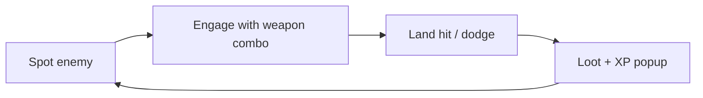
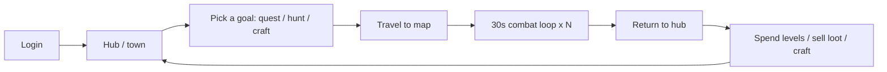
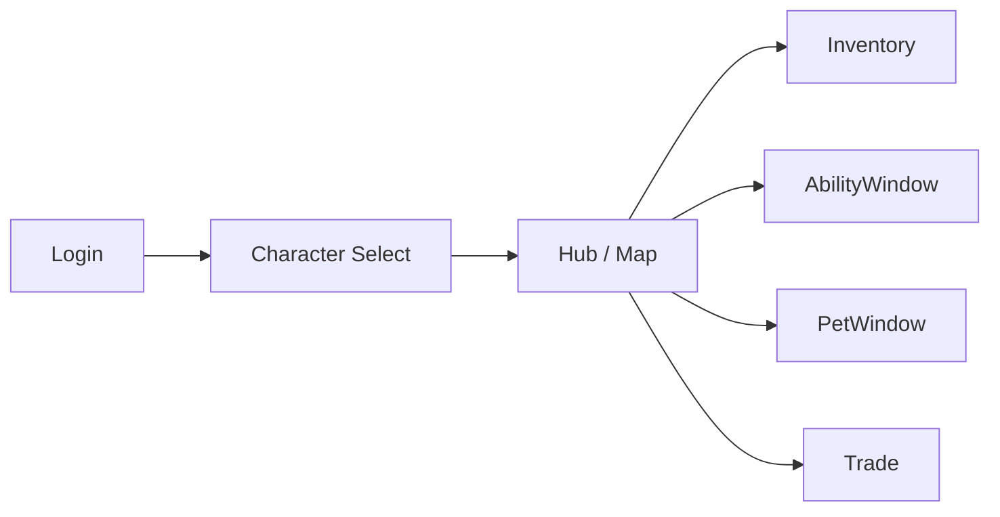

# {{Game Title}} — Game Design Document

> **Version:** v0.1 — draft
> **Last updated:** {{YYYY-MM-DD}}
> **Owner:** {{Author}}
> **Status:** Pre-production / Vertical slice / Alpha / Beta / Live

---

## 1. Executive summary

A two-paragraph elevator pitch. By the end, a reader should know **what the
game is**, **who it's for**, and **why it's worth playing now**.

- **One-line pitch:** {{Single sentence — genre, hook, audience.}}
- **High concept:** {{Two or three sentences expanding the pitch — the fantasy
  the player gets to live, and what makes that fantasy uniquely satisfying
  here.}}
- **Reference points:** {{e.g. MapleStory's class fantasy + Ragnarok's card
  system + New World's weapon-driven identity. Name real games — the team and
  the reader both know what they mean.}}

## 2. Design pillars

Three to five short phrases that **every** later decision is measured
against. If a feature doesn't serve a pillar, it doesn't ship.

1. **{{Pillar name}}** — {{One sentence on what this pillar means in practice
   and how you'd know a feature violates it.}}
2. **{{Pillar name}}** — {{…}}
3. **{{Pillar name}}** — {{…}}

> ⚠ Open question: {{If pillars conflict in known ways, name the conflict
> here so future decisions can reference it.}}

## 3. Game overview

| Field | Value |
|---|---|
| Genre | {{e.g. 2D platformer MMORPG}} |
| Sub-genre | {{e.g. server-authoritative co-op + open-world grind}} |
| Engine | Godot 4.5+ (Forward Plus) |
| Platforms | {{Windows / Linux / Mac / Steam}} |
| Network model | Server-authoritative; clients send intent via RPC |
| Topology | {{Steam-lobby co-op (dev/test ENet + Postgres; official server later opt-in)}} |
| Players per session | {{e.g. 1–8 host-and-friends, with bots filling out the world}} |
| Session length | {{e.g. 20–45 minutes for a typical play session}} |
| Target audience | {{Demographic + psychographic — who would describe this as "their kind of game"?}} |
| Rating target | {{e.g. T for Teen — fantasy violence}} |
| Monetisation | {{Premium / F2P / cosmetic / none — and *why*}} |

## 4. Player experience goals

What should the player **feel** at each scale? Be specific. "Fun" doesn't count.

- **Moment-to-moment (seconds):** {{e.g. "every hit feels chunky — clear
  windup, big hitstop, satisfying number popping out"}}
- **Session (minutes):** {{e.g. "I came back from a hunt with one new card
  and three levels — I want to spend them right now"}}
- **Long-term (hours/days):** {{e.g. "my warrior feels different from my
  friend's warrior because I picked sword instead of axe"}}

## 5. Core loops

The **30-second loop** is what the player does over and over. The **session
loop** is what brings them back tonight. The **meta loop** is what brings them
back next week.

### 5.1 30-second loop



{{Walk through what the player is *thinking* and *feeling* at each beat. What
is the moment of decision? What is the moment of payoff?}}

### 5.2 Session loop



### 5.3 Meta loop (week-over-week)

{{e.g. "Unlock a new weapon → re-run earlier maps for that weapon's specific
drops → build toward a new card set → respec around the set"}}

## 6. Story, setting & world

### 6.1 Setting

{{Where and when does this take place? What is the dominant mood?}}

### 6.2 Tone

{{e.g. "Bright fantasy with a melancholy undertone — Maple's silhouettes but
Wonderking's quietness."}}

### 6.3 Plot beats (high level)

- **Act 1 — onboarding (lvl 1–10):** {{the inciting incident; who the player
  is; what they want.}}
- **Act 2 — first class advancement (lvl 10–30):** {{the wider world opens
  up; the first real choice.}}
- **Act 3 — endgame opens (lvl 30+):** {{the fork — what kind of hero are
  you becoming?}}

### 6.4 Factions / regions

| Region | Level range | Vibe | Key NPCs / quests |
|---|---|---|---|
| {{e.g. Henesys Town}} | 1–15 | Pastoral, safe | Tutorial NPC, first job advancer |
| {{…}} | | | |

## 7. Characters & classes

### 7.1 Player character

- **Identity:** {{Customisation surface — what does the player choose at
  character create? Name, gender, hair, starting weapon?}}
- **Visual constraint:** {{If using fixed sprites — e.g. four base sprites
  (swordsman / archer / mage / rogue), no paperdoll — name that constraint
  here. It shapes every other section.}}

### 7.2 Classes

| Class | Primary stat | Secondary stat | Weapons | Role |
|---|---|---|---|---|
| Warrior | STR | DEX | Sword, Axe | Frontline melee |
| Archer | DEX | STR | Bow, Crossbow | Ranged DPS |
| Mage | INT | LUK | Wand, Staff | Burst + utility |
| Rogue | LUK | DEX | Dagger, Claw | Mobility + crit |

> ⚠ Open question: {{e.g. "Weapon-driven identity vs. the existing 9-class
> structure — see [project_weapon_identity_overhaul] memory. v1 collapses to
> 4 base sprites + weapon as identity; class is implicit."}}

### 7.3 NPCs

{{Job advancers, quest givers, merchants. Reference real NPCs from the maps
once they exist.}}

## 8. Combat system

### 8.1 Core combat verbs

- **Attack** — {{basic attack contract, animation cancel rules}}
- **Ability** — {{hotbar abilities, mana cost, cooldown}}
- **Dodge / iframes** — {{is there one? if not, what replaces it?}}
- **Status effects** — {{stuns, knockback, DOTs}}

### 8.2 Damage formula

```
final_damage = (
    weapon_attack * weapon_mult
    + primary_stat_contribution
    + secondary_stat_contribution
) * (1 + mastery_bonus)
  * (1 + crit_bonus if crit else 0)
  * (1 - target_defense_reduction)
  * hit_chance_modifier
```

{{Pull the real formula from `scripts/Components/CombatComponent.gd` and the
balance simulator addon. Show one worked example with real numbers.}}

### 8.3 Hit/miss & crit

{{Hit chance formula. Crit chance, crit damage. Reference the balance
simulator dock that mirrors `_execute_hit`.}}

### 8.4 Threat / aggro

{{If multiplayer, who do enemies target and why?}}

### 8.5 Death & respawn

{{Death penalty. Where do you respawn? What do you lose?}}

## 9. Progression systems

### 9.1 Levels & XP

- **Level cap:** {{e.g. 200}}
- **XP curve:** {{Show the curve. Note the inflection point (e.g. "exponential
  past lvl 30 — that's where the grind kicks in").}}

### 9.2 Stat points

{{Per level, how many points? Spent how? Respec rules?}}

### 9.3 Abilities

{{Three-layer model — formulas (Layer 1) + active behavior logic scripts
(Layer 2) + proc handlers (Layer 3). Cross-reference
[ability-mechanics-shape] memory.}}

### 9.4 Weapon mastery

{{If weapon-driven identity is the direction — how do weapons themselves
level up? What does mastery unlock?}}

### 9.5 Class advancement

{{Level 30 first job advancement. Future advancements? What does the player
choose?}}

## 10. Items, equipment & economy

### 10.1 Item categories

| Category | Examples | Stack? | Tradeable? |
|---|---|---|---|
| Weapon | Sword, Bow, Wand | No | Yes |
| Armor | Helm, Chest, Boots | No | Yes |
| Consumable (potion) | HP pot, MP pot | Yes | Yes |
| Consumable (pet food) | Pet food | Yes | Yes |
| Consumable (pet skill book) | Pet command books | Yes | Yes |

### 10.2 Rarity & affixes

{{Rarity tiers, what they affect, how affixes roll.}}

### 10.3 Equipment slots

{{Slot layout. Set bonuses?}}

### 10.4 Crafting & enchanting

{{Cross-reference [project_crafting_roadmap] memory. Note what's v1 vs.
later.}}

### 10.5 Economy

- **Currency:** {{Mesos / gold / etc.}}
- **Sinks:** {{Repair, respec, gacha-card-pack, etc.}}
- **Faucets:** {{Mob drops, quest rewards, daily login.}}

## 11. Enemies & AI

### 11.1 Enemy tiers

| Tier | Level range | Role | Examples |
|---|---|---|---|
| Trash mob | 1–10 | Filler density | Snail, Slime |
| Elite | scales with map | Mini-boss | {{…}} |
| Boss | discrete encounters | Story / loot gate | {{…}} |

### 11.2 Enemy AI patterns

{{State machine: idle → aggro → attack → leash. Where does it live? How does
the server author this?}}

### 11.3 Bots (the *third* non-player entity)

{{Use the CONTEXT.md definition exactly: "server-side AI participant with a
negative peer id, drives the same `MultiplayerPlayerV2` character a human
would". Where do bots fit in the player experience? Erenshor-style population
filler? Party-filling co-op?}}

### 11.4 Pets (the *first* non-player entity)

{{Use the CONTEXT.md definition exactly. Reference
[docs/adr/0001-pet-system-architecture.md]. 1 pet per owner in v1.}}

## 12. Levels, maps & world topology

### 12.1 Map structure

{{2D side-scrolling maps connected by portals. Map IDs, level ranges, who
owns spawning, channel switching.}}

### 12.2 Channels

{{What channels are, why they exist, who switches them.}}

### 12.3 Map roster (v1)

| Map | Level range | Theme | Notable mobs / NPCs |
|---|---|---|---|
| {{Map 1}} | 1–10 | Tutorial | Snail, Job NPC |
| {{Map 4}} | 15–25 | Forest | Bird, Deer, Fox |
| {{…}} | | | |

## 13. Multiplayer & social systems

### 13.1 Topology

{{Reference [project_topology_steam_lobby] memory. Steam-lobby co-op is the
direction; ENet+Postgres is dev/test; an official server is a later opt-in.
What does this mean for the player?}}

### 13.2 Parties

{{Party size, XP sharing, loot rules. Cross-reference `PartyManager`.}}

### 13.3 Trading

{{Player-to-player trading rules. Cross-reference `TradeManager`.}}

### 13.4 Chat & commands

{{Channels (all / party / whisper). Slash commands. Bot commands.}}

### 13.5 Friends & guilds (if any)

{{v1 scope vs. later.}}

## 14. Quests & onboarding

### 14.1 Quest philosophy

{{Reference [quest-system-shape] memory: "quests defined in code,
server-authoritative, level-1→30 guided journey + onboarding".}}

### 14.2 Onboarding sequence (lvl 1–5)

{{Step-by-step what the new player does in their first 10 minutes.}}

### 14.3 Quest types

| Type | Example | Reward | Where it lives |
|---|---|---|---|
| Kill X mobs | "Defeat 10 Snails" | XP + meso | QuestManager |
| Fetch | "Bring 5 Slime Bubbles" | XP + item | QuestManager |
| Talk to NPC | "Speak to Job Advancer" | Class change | QuestManager |

## 15. User interface & UX

### 15.1 Screen flow



### 15.2 HUD

{{Health bar, mana bar, hotbar, party frames, minimap. What's always on
screen, what's toggled?}}

### 15.3 Windows

{{Inventory, abilities, equipment, quest log, pet, trade. Note the
[feedback_input_lock_pattern] memory: new in-game overlays MUST call
`InputManager.set_input_locked(true/false)` on open/close.}}

### 15.4 Accessibility

{{Colorblind palette, font scaling, rebindable keys, motion sensitivity,
subtitles.}}

## 16. Art direction

### 16.1 Visual pillars

{{Reference [project_art_constraint] memory: 4 static sprites + asset packs,
no paperdoll, no budget for more — this is the load-bearing constraint, not
a preference.}}

### 16.2 Style references

{{Real games / art: MapleStory, Ragnarok, Wonderking, Spirit Vale. Specific
*screens* if possible — "we want the silhouette legibility of Maple's
Henesys but the muted palette of Wonderking's Forest of Calm".}}

### 16.3 Asset pipeline

{{Where assets come from, what formats, who/what processes them.}}

## 17. Audio design

### 17.1 Music

{{Per-map tracks. Mood map: town = warm, dungeon = tense, boss = urgent.
Reference `AudioManager`.}}

### 17.2 SFX

{{Combat (hit, crit, miss, death), UI (button, error, level-up), ambient
(map loops).}}

### 17.3 Notable rule

{{From [project_visible_doesnt_gate_audio] memory: hiding a map's render tree
doesn't gate its audio — `AudioStreamPlayer2D` calls must check
`is_visible_in_tree()` to avoid bleed across the SubViewport-per-map setup.}}

## 18. Technical architecture

A compressed view; the full picture lives in the CLAUDE.md hierarchy.

### 18.1 Server authority

The server owns all critical state. Clients send **intent** via RPCs; the
server validates, mutates, and broadcasts authoritative results.

### 18.2 Autoload singletons

{{Brief description of `MultiplayerManager`, `PlayerManager`, `BotManager`,
`PetManager`, `ResourceManager`, `SaveManager`, `MapManager` and what role
each plays in the player experience.}}

### 18.3 Component-based characters

{{Health, Stats, Combat, Ability, Buff, Equipment, Inventory under a root
character node. Cross-reference `scripts/Components/CLAUDE.md`.}}

### 18.4 Data-driven content

{{`.tres` resources auto-loaded by `ResourceManager` from
`resources/Abilities/`, `resources/Items/`, `resources/Buffs/`,
`resources/Player/Classes/`. Enemies are referenced directly via
`enemy_data`, NOT auto-loaded.}}

### 18.5 Persistence

- **Account / character records:** PostgreSQL via Flask API.
- **In-game state:** `SaveManager` writes player JSON to the server + DB.

### 18.6 Performance targets

| Metric | Target |
|---|---|
| Frame rate | 60 fps on mid-tier hardware |
| Concurrent players per server | {{e.g. 32}} |
| Tick rate | {{e.g. 30 Hz authoritative}} |
| Cold-start to playable | {{e.g. <15 s}} |

## 19. Production roadmap

### 19.1 Current state

{{One paragraph: what works today, what's in flight, what's blocked.}}

### 19.2 Milestones

| Milestone | Scope | Target | Status |
|---|---|---|---|
| **V1 — vertical slice** | {{1–30 progression, 4 classes, 5 maps, 1 boss, parties of 4, bots}} | {{date}} | In progress |
| **V2 — public beta** | {{Steam lobby, friends list, full quest line}} | {{date}} | Planned |
| **V3 — official server** | {{Breck-hosted official server opt-in}} | {{date}} | Planned |

### 19.3 Out of scope (v1)

{{Explicit non-goals. The reader should know what you've *decided not to
build* — that's as informative as what you have.}}

## 20. Risks, open questions & appendix

### 20.1 Top risks

| Risk | Likelihood | Impact | Mitigation |
|---|---|---|---|
| {{Art bottleneck: 4-sprite constraint limits build variety}} | High | High | Lean on weapon FX + cards for visual differentiation |
| {{Multiplayer desync edge cases}} | Med | High | Server-authoritative is the moat; invest in deterministic tests |
| {{…}} | | | |

### 20.2 Open questions

- ⚠ {{Question}} — {{context, what would resolve it, who decides.}}
- ⚠ {{Question}} — {{…}}

### 20.3 Glossary

See [CONTEXT.md](../CONTEXT.md). Use those terms — don't invent synonyms.

### 20.4 References

- [CLAUDE.md](../CLAUDE.md) — repo-wide truths
- [CONTEXT.md](../CONTEXT.md) — domain glossary
- [docs/adr/](adr/) — architectural decisions
- {{External: design references, mood boards, inspiration links}}
