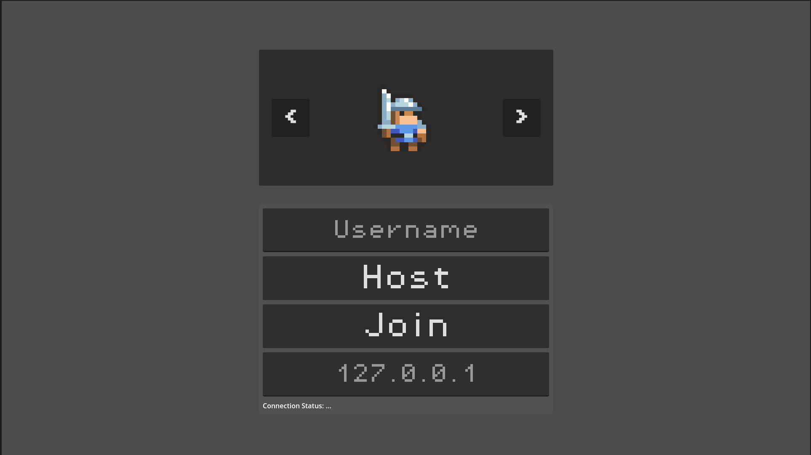

# Multiplayer Godot Project

Welcome to the **Multiplayer Godot Project**! This project is a demonstration of multiplayer features built using the Godot Engine. It includes player movement, enemy AI, collectibles, and networked gameplay.

## Features

- Host/Join from the main menu with a listen server on port 8080 by default
- Channel switching between ports with safe reconnect (client-side)
- Server-authoritative player controller with RPC-driven inputs
- Character selection from the main menu with class/sprite changes
- Health system with damage, invulnerability frames, regen, death/respawn
- Collectibles with pickup animation
- Killzones that trigger server-authoritative death
- Droppable one-way platforms and mobile HUD support
- Enemy AI and spawners

## Screenshots

### Main Menu


### In-Game View


## Getting Started

1. **Open the project in Godot Engine (version 4.x recommended).**
2. Run the `main_menu.tscn` scene to start playing.
3. For multiplayer, launch multiple instances and connect via the provided UI or script.

### How to Play (Multiplayer)
- Host: starts a listen server on port 8080 and spawns the host player.
- Join: connects to the IP in the input box (validated) on port 8080.
- Channel switching: use the UI arrows to switch ports; the client disconnects/cleans up and reconnects safely.

#### Flow details
- After hosting, the game switches into the in-game scene automatically.
- On join, the server asks the client for their character selection; the server then spawns that character for the player.
- Your username is captured from the main menu and synced to your player label.

### Controls (default actions)
- Move: `Move Left` / `Move Right`
- Down: `Move Down`
- Jump: `Jump`
- Attack: `Attack`

Notes:
- Mobile HUD buttons drive the same actions on touch devices.
- Input is sent to the server via a `MultiplayerSynchronizer`; the server is authoritative.

## Folder Structure

- `scenes/` — Main game scenes
- `scripts/` — GDScript files for logic and components
- `assets/` — Sprites, sounds, music, and fonts
- `resources/` — Data and resource files
- `README/` — Project documentation and screenshots

## Multiplayer Architecture (from `scripts/`)

- `Managers/`
  - `multiplayer_manager.gd`
    - Signals: `server_has_started`, `channel_switch_started/success/failed`.
    - Config: `DEFAULT_PORT` (8080), `DEFAULT_IP` (127.0.0.1).
    - Public API: `host_game()`, `join_game()`, `switch_channel(port)`, `reset_data()`, `change_level(scene)`.
    - Behavior: initializes signal wiring to Client/Server/Channel managers; hides/shows menu UI; tracks `host_mode_enabled` and `respawn_point`; returns to main menu on disconnect; starts dedicated server when the `dedicated_server` feature is present.
  - `server_manager.gd`
    - Signals: `server_started`, `server_failed`.
    - Public API: `start_listen_server(port)`, `start_dedicated_server(port)`, `stop_server()`, `get_current_port()`, `get_server_info()`.
    - Behavior: owns the `ENetMultiplayerPeer` for the server; sets `multiplayer.multiplayer_peer`; retries ports for dedicated server up to a small cap.
  - `client_manager.gd`
    - Signals: `connection_succeeded`, `connection_failed`.
    - Public API: `connect_to_server(ip, port)`, `cleanup()`/`_disconnect()`, `get_connection_info()`, `get_connection_status()`, `create_new_peer(ip, port)`.
    - Behavior: owns the client `ENetMultiplayerPeer`; sets `multiplayer.multiplayer_peer`; tracks current IP/port and connection timestamps; emits results consumed by `MultiplayerManager`.
  - `player_manager.gd`
    - State: `active_players: { id -> {character_type, spawn_time, synced} }`.
    - Public API: `add_host_player()`, `add_player(id)`, `remove_player(id)`, `cleanup()`, `force_respawn_player(id)`, info getters.
    - Behavior: on join, requests client character selection via RPC, spawns the chosen character under `Level/Players`, syncs existing networked entities to the new peer, and updates tracking; removes entities on disconnect.

- `Networking/`
  - `channel_manager.gd`
    - Signals: `switch_started`, `switch_success`, `switch_failed`.
    - Public API: `switch_channel(new_port)`, `is_switching()`, `get_switch_progress()`.
    - Behavior: tests reachability of the target port, cleans up entities, disconnects, creates a new client peer, waits for connection (with timeouts), updates UI PID; on failure, returns to main menu.
  - `network_utils.gd`
    - Validation: `is_valid_ip(text)`, `is_valid_port(port)`, `is_port_in_range(...)`.
    - CLI: `get_port_from_args(default)`, `get_string_arg(name)`, `has_flag(name)`.
    - Scene helpers: `get_players_spawn_node(tree)`, `get_node_safe(node, path)`.
    - Cleanup/logging/testing: `clear_networked_entities(tree)`, `log_network_event(...)`, `test_tcp_connection(ip, port)`.

- `Player/`
  - `multiplayer_controller_v2.gd`
    - Role: authoritative character controller. Exports references to Health/Combat/Leveling/Stats/Class/Debug and UI.
    - Server duties: processes input/state via a state machine, manages facing/animations, death/respawn, persistent save/load (`player_<username>.json`), class/sprite changes, drop-through logic, and cleanup before removal (for channel switching).
    - Client duties: shows HUD and camera for local player; requests sprite state and data from server.
  - `multiplayer_input.gd`
    - Role: local-authority `MultiplayerSynchronizer`; samples input, mirrors facing direction, RPCs `jump()`, `attack()`, and `drop()` to the server; provides cleanup to avoid stale references.

- `Components/`
  - `health.gd`: health/regen/invulnerability signals and RPCs; integrates with leveling and HUD.
  - `stats.gd`: level- and class-driven stat computation with derived values.
  - `level.gd`: EXP curve and level-up signals; server-side add-exp.
  - `class.gd`: authoritative class changes and bonuses.
  - `combat.gd`: timed hitbox attacks, stat-aware damage, per-attack de-duplication.

- Gameplay scripts
  - `killzone.gd`: server-only death trigger for `MultiplayerPlayerV2` using the player's `HealthComponent`.
  - `platform.gd`: stops client-side platform animation for authority correctness.

High-level host/join flow
- Host: Main Menu → `MultiplayerManager.host_game()` → `ServerManager.start_listen_server()` → `server_started` → connect peer signals → load `game.tscn` → `PlayerManager.add_host_player()` → spawn under `Level/Players`.
- Join: Main Menu → `MultiplayerManager.join_game()` → `ClientManager.connect_to_server()` → `connected_to_server` → hide menu and show connection panel → `PlayerManager._request_character_selection` → server spawns chosen character.

## Component Systems

The player and enemies are composed from small, focused components that live as child Nodes on the character scene. All state-changing logic executes on the server; clients submit intent only.

- Health (`scripts/Components/health.gd`)
  - Exports: `max_health`, `health_bar_path` to a `ProgressBar` UI.
  - Signals: `health_changed(current, max)`, `damaged(amount, source)`, `died(killer)`.
  - RPCs: `take_damage(amount, source, ignore_invuln)`, `heal_damage(amount, source)`, `die()`. Guarded so only the server mutates.
  - Behavior: 0.5s invulnerability after damage; passive regen every ~5s (~10% of max); integrates with `LevelingComponent` to update `max_health` on level up; updates bound UI automatically.
  - Death/Respawn: sets `is_dead`, emits `died`, and expects the controller to call `respawn()` which restores health to max.

- Stats (`scripts/Components/stats.gd`)
  - Base stats with per-level growth: strength, dexterity, intelligence, vitality.
  - Reacts to `LevelingComponent.leveled_up` and `ClassComponent.class_changed` to recalculate.
  - Provides getters and derived stats: `get_attack_power()`, `get_magic_power()`, `get_defense()`, `get_critical_chance()`.

- Leveling (`scripts/Components/level.gd`)
  - Signals: `experience_changed(current, exp_to_level)`, `leveled_up(new_level)`.
  - Exports: `max_level`, `base_exp`, `exp_growth` (exponential curve).
  - RPC: `add_exp(amount)`; increments EXP, loops level-ups while enough EXP remains.

- Class (`scripts/Components/class.gd`)
  - Enum-backed class selection: Swordsman, Archer, Mage.
  - Exports class bonuses and skills per class; `change_class_rpc(new_class)` for server-authoritative swaps.
  - On change, emits `class_changed` and triggers Stats recalculation.

- Combat (`scripts/Components/combat.gd`)
  - Exports: `attack_map: Dictionary[String, AttackData]`, and an `attack_hitbox: CollisionShape2D`.
  - Usage: server calls `perform_attack(name)`. After a configurable `damage_delay`, enables the hitbox `Area2D`, iterates overlaps once, applies damage, then disables after `attack_duration`.
  - Orientation: aligns hitbox to owner `facing_direction` each attack.
  - Damage formula: starts from `AttackData.damage`, then applies class-appropriate scaling from Stats (e.g., STR/DEX/INT bonuses).
  - Debounce: `hit_list` ensures a body is only hit once per attack window.

- Debug (`scripts/Components/debug.gd`)
  - Dev-only panel with buttons to heal, damage (ignoring invuln), force revive, and grant EXP to next level.
  - Hooks into the player via `set_player()` and health via `set_health_component()`.

- Component test (`scripts/Components/component_test.gd`)
  - Utility for verifying wiring in scenes; prints summaries for Class, Stats, Leveling, Health, and Combat and supports quick class/level tests.

Component wiring guidelines
- Put these as children on the character root (e.g., `Player/Health`, `Player/Stats`, `Player/Leveling`, `Player/Class`, `Player/Combat`).
- In `MultiplayerPlayerV2`, set the exported references (`health_component`, `combat_component`, `level_component`, `stats_component`, `class_component`, `debug_component`).
- Health: set `health_bar_path` to your HUD ProgressBar.
- Combat: assign `attack_hitbox` and populate `attack_map` with `AttackData` resources.

Example wiring
```gdscript
# In the Inspector for CombatComponent
attack_map = {
    "basic": preload("res://resources/Player/Attacks/attack_1.tres"),
    "heavy": preload("res://resources/Player/Attacks/attack_2.tres")
}
attack_hitbox = $"../../Hitbox/BasicAttackHitbox"
```

### Character selection and sprites
- Characters available: Swordsman, Archer, Mage (select in main menu).
- The server applies class changes and picks the best sprite set based on the player level.
  - Sprite frames are chosen per class based on level thresholds (e.g., 1 and 15).
  - New clients receive the current sprite state on connect to ensure visual consistency.

### Networking notes
- Server is authoritative for movement, combat, health, and respawn logic.
- Clients send intent (jump/attack/down) via RPCs; the server simulates and replicates.
- Networked entities are tagged with the `networked_entities` group for consistent cleanup.
- When a new player joins, existing entities can sync their state just to that peer (e.g., current animation/state).
- Main menu UI is updated on host/join to show connection status and the player's unique ID.

### Scene requirements
- The gameplay scene should have a `Level` node with a `Players` child; spawns are added under `Level/Players`.
- A UI node named `%MenuContainer` must exist in the main menu for host/join controls and player name entry.
  - It provides: `selected_character`, `get_username()`, and `setup_PID_label(is_host, pid)` used by the managers.

### Persistence
- On the server, player data is saved to `player_<username>.json` via RPCs from `multiplayer_controller_v2.gd`.
- When a player joins, the server will load their file if present and update components (health, level, exp).
- Delete the corresponding `player_<username>.json` file to reset progress.
Details:
- Save triggers on server when health changes or experience/level changes.
- Persisted fields include: `username`, `max_health`, `current_health`, `level`, and `experience`.

### Dedicated Server
- `multiplayer_manager.gd` will start a dedicated server if the build has the `dedicated_server` feature.
- Port selection supports a `--port <number>` command-line argument (default 8080).
- Typical usage: run a dedicated-server export or add the `dedicated_server` feature and launch headless with `--port 8080`.
Example (headless):
```
godot --headless --feature dedicated_server --path . -- --port 8080
```

### Channel switching details
- Clients can change channels (ports) without restarting the game.
- The flow is: test reachability of the new port → clean up local entities → disconnect → create a new ENet client → wait for connection or timeout → update UI with new PID.
- Timeouts: quick reachability test (~2s) and connection establishment (~8s) guard against stalls.
- On failure, the client is returned to the main menu with an error message.

### Health & kill/respawn details
- HealthComponent emits: `health_changed`, `damaged`, `died`.
- Invulnerability frames: ~0.5s after taking damage; subsequent hits during this window are ignored unless forced.
- Passive regeneration: every ~5s restores ~10% of max health (server-side, only when alive).
- Killzones: server checks if the body is a `MultiplayerPlayerV2` and calls `die.rpc()` to trigger the death sequence.
- Respawn: server sets the player position to `MultiplayerManager.respawn_point` and restores full health.

### Input & dropping through platforms
- The input synchronizer runs only for the local authority and sends intent to the server.
- Drop-through: hold `Move Down` and press `Jump` to pass through drop-through platforms. The player temporarily disables collision with the platform's layer.

### Autoload singletons (expected)
- `MultiplayerManager`, `ServerManager`, `ClientManager`, `PlayerManager`, `ChannelManager`, `NetworkUtils` should be configured as AutoLoads and accessible globally.

## Credits

- Built with [Godot Engine](https://godotengine.org/)
- Art and sound assets from [Kenney.nl](https://kenney.nl/) and other open sources

## License

This project is for educational and demonstration purposes. See individual asset folders for specific licenses.
