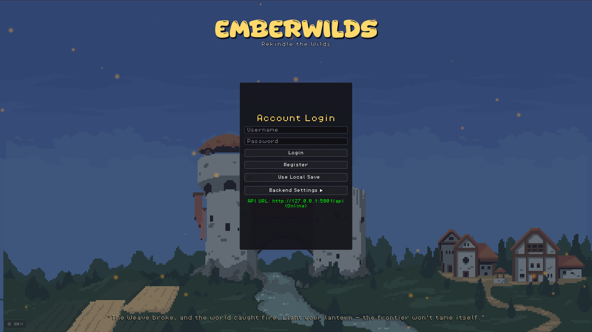
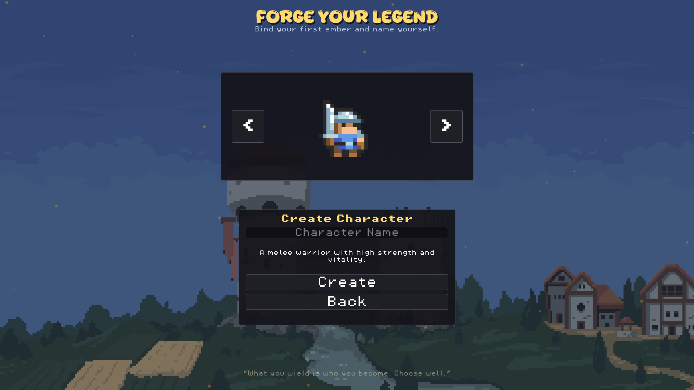
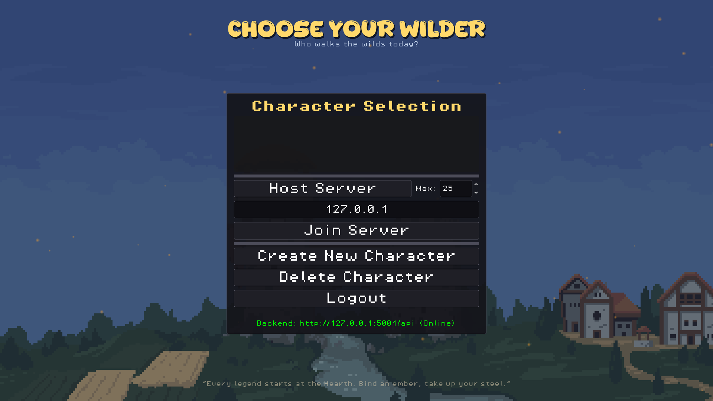
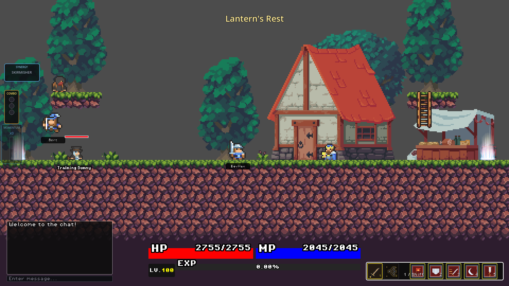
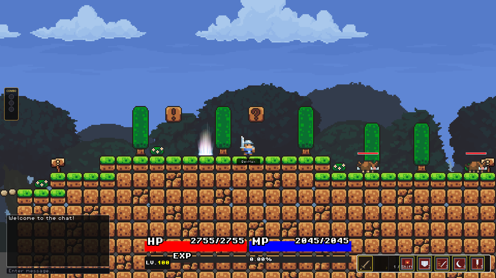
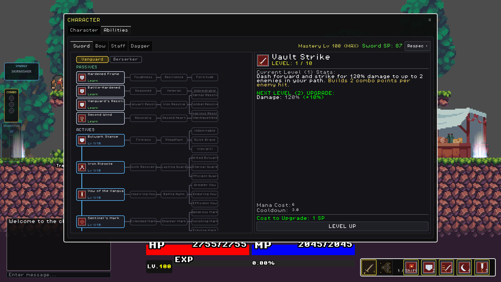
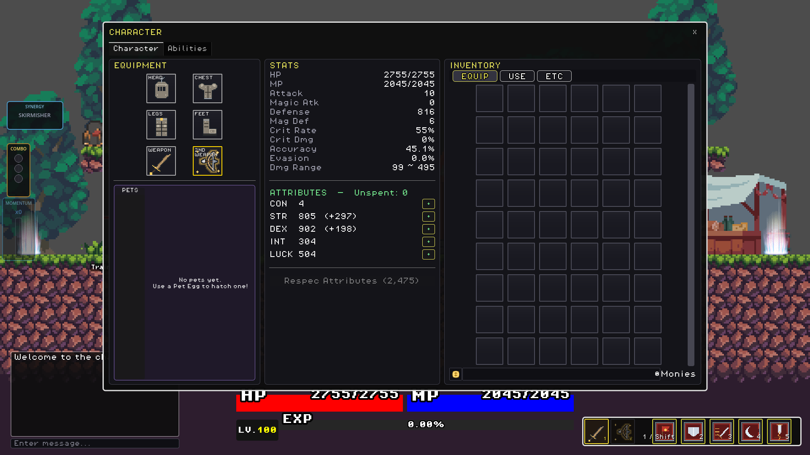

# Emberwilds

> *Rekindle the wilds.*

The Weave that held all magic shattered, and its power rained down as **embers** —
glowing shards of broken magic that warped the wild into monsters. Generations
later, the survivors learned the one art that still works: an ember can't be
wielded barehanded, but **bound into a weapon, it can be channelled.**

You're a **Wilder.** Take up your steel, light your lantern, and head past the safe
glow of the Hearth into the ember-soaked frontier. **Emberwilds** is a
cozy-but-dangerous **2D co-op hunting RPG** where *your weapon is your class* —
master it, dual-wield a second, and rebuild it into something nobody else plays.
Bring friends. The wilds won't tame themselves.



## Screenshots

| Forge your legend | Choose your Wilder |
|---|---|
|  |  |

| Lantern's Rest — the Hearth hub | Hunting the Near-Wilds |
|---|---|
|  |  |

Dual-wield: two weapons equipped at once light up two signature gauges (here Sword
**Combo** + Bow **Momentum**) and unlock a **Synergy** all their own —


| Weapon mastery & ability trees | Your character, your way |
|---|---|
|  |  |

## What makes it yours

### Your weapon is who you are
No classes to pick. Wield a **Sword, Bow, Staff, or Dagger** and you *become* a
vanguard, a marksman, a stormcaller, an assassin. Each plays completely
differently — its own rhythm, its own fantasy, and a signature gauge you build up
and unleash for a payoff. Master a weapon and the bond only deepens.

### Two weapons, one build
Carry **two weapons at once.** Their abilities stack, both their gauges light up,
and the pairing unlocks a **synergy** of its own — a sword-and-bow skirmisher hits
nothing like a staff-and-dagger spellblade. Swap loadouts mid-fight and keep the
pressure on.

### Build it, break it, rebuild it
Pour your level-ups into the stats you want — go glass-cannon, go unkillable, or
anything in between. Every ability has a **branching upgrade tree** where the deep
choices *change how it plays*, not just the numbers. Changed your mind?
**Respec and rebuild — for a price.** Coin well spent to chase the next idea.

### Hunt together
Host a lobby, invite your friends, and farm the wilds as a party — everyone levels
faster together, and roles emerge from what each of you chose to wield. Short on
friends? **AI companions** fill out the party and the world, fighting at your side
and focusing your target. Hatch a **pet** to auto-loot, auto-pot, and buff you
while you fight.

### A frontier worth pushing back
Start at **Lantern's Rest**, a warm frontier Hearth, and venture out through
portal-linked wilds — overgrown fields, goblin-held woods, drowned mines, and the
ruins of the world that broke, each deadlier than the last. At the bottom waits the
deathless **Eternal Warlord.** Number pops, loot drops, "just one more rank" — it's
MapleStory hunting with the build freedom of a modern action RPG.

## Get in the wilds

Emberwilds runs in **Godot 4.5+** — open the project and press **F5**.

For accounts and characters that persist between sessions, start the backend first:

```bash
docker-compose up -d
```

Then **Host** a game or **Join** a friend by entering their IP. New Wilders begin
at the Hearth — talk to the locals, step through a glowing portal, and start
hunting. Hosting for friends outside your network? See [DEPLOYMENT.md](DEPLOYMENT.md).

> **Just want to swing a sword?** On the login screen, press **F9** for one-click
> skip-to-combat buttons that drop a ready-made Wilder straight into the field.

### Controls (rebindable in Options)

| Action | Input |
|---|---|
| Move left / right | A / D (or ← / →) |
| Move up / down | W / S (or ↑ / ↓) |
| Jump | Space |
| Basic attack | Left Ctrl |
| Weapon signature (unleash gauge) | R |
| Swap weapon loadout | Tab |
| Ability hotkeys | 1 – 8 |
| Pick up item | Z |
| Character (stats / equipment / inventory) | C / E / I |
| Abilities (skill tree) | K |
| Party | P |
| Quest log | Q |
| Interact with NPC / chest | Right-click |

Drop through one-way platforms: hold **Move Down** and press **Jump**.

## Under the hood

Emberwilds is built in **Godot 4** with a Flask + PostgreSQL backend for accounts
and saves. Contributing or just curious how it works? Start with
[CLAUDE.md](CLAUDE.md) and the [Game Design Document](docs/GDD.md); what's planned
next lives in [TODO.md](TODO.md).

## Credits

- Built with [Godot Engine](https://godotengine.org/)
- Art from open-source pixel-art packs (Minifolks character & creature sprites,
  Country-village tileset & parallax pack, plus various creature spritesheets);
  UI font: PixelOperator. See individual asset folders for per-pack licensing.

## License

This project is for educational and demonstration purposes. See individual asset
folders for specific licenses.
