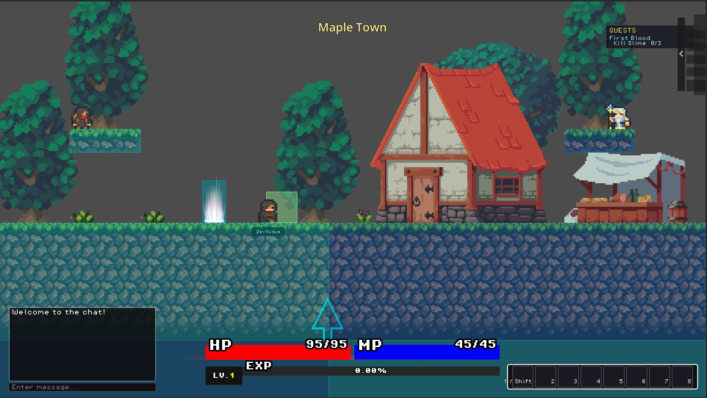
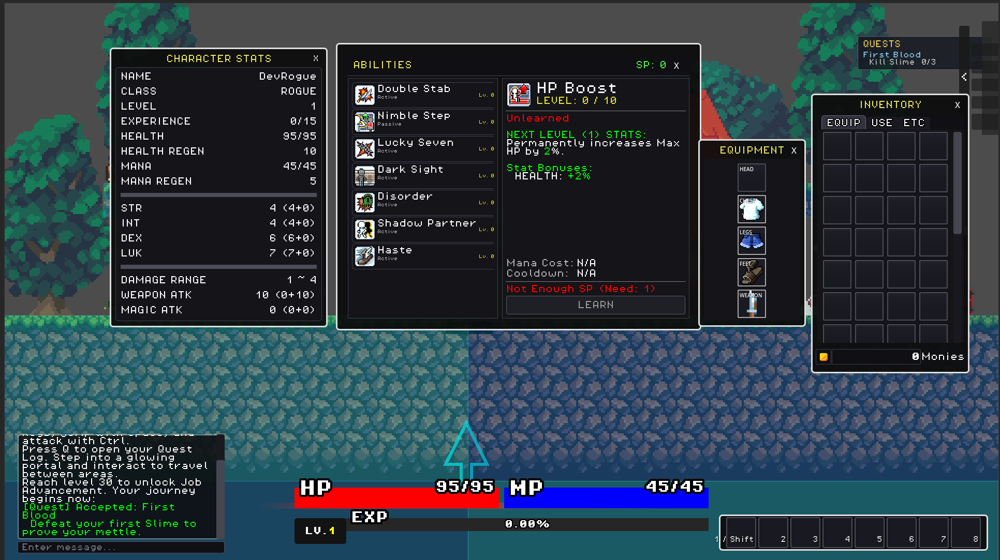
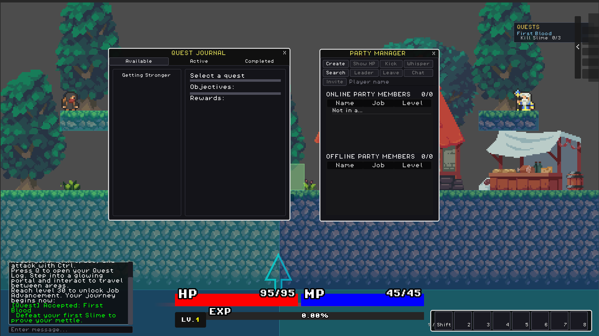
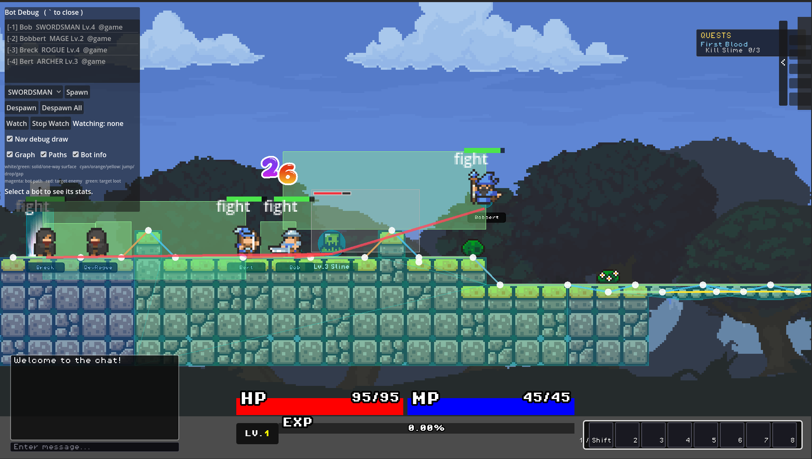

# Multiplayer Godot RPG

A **server-authoritative multiplayer RPG** built with Godot 4.5+, modeled on
MapleStory: 2D side-scrolling platformer with component-based characters,
data-driven content, and a Flask + PostgreSQL backend for account and character
persistence. Host a server, invite your friends, grind a meadow into a forest
into a shadowfell, and advance your job at level 30.

## Features

### Multiplayer & Persistence
- Server-authoritative architecture — the server validates all state, clients send intent via RPCs
- Host/join networking on a listen server, with in-game channel (port) switching
- Account & character system persisted to PostgreSQL via a Flask REST API
- Dedicated headless server support

### Characters & Progression
- **Four base classes** — Swordsman, Archer, Mage, Rogue — each with its own
  class abilities, stat growth, and per-level sprite frames
- **Job Advancement at level 30** via the Job Master NPC in town: Swordsman →
  Crusader, Archer → Ranger, Mage → Archmage, Rogue → Assassin
- Component-based characters: Health, Mana, Stats, Combat, Class, Leveling,
  Ability, Buff, Equipment, Inventory
- Ability system with cooldowns, skill points, prerequisites, stat scaling, and proc effects
- Buff/debuff system with stacking, durations, and custom logic hooks
- Skills learned as a base class carry over after advancing

### Quests & Onboarding
- **Guided level-1→30 quest journey** of 13 chained quests covering the
  beginner / early / mid / advancement tracks
- **First-login onboarding**: a brand-new character is greeted in town, given a
  starter quest automatically, and walked through controls in chat
- **Always-on Quest Tracker HUD** in the top-right that shows active quests
  and their objective progress in real time
- KILL, COLLECT, and REACH_LEVEL objectives with prerequisites and chained
  unlock notifications
- Capstone **"Answer the Call"** quest at level 25→30 directs the player to
  the Job Master for advancement

### RPG Systems
- Inventory with stacking, drag-and-drop, and server validation
- Equipment slots (head, chest, legs, feet, weapon) with stat bonuses and visual changes
- Consumables — heal, restore mana, grant experience, town teleport
- Merchant buy/sell and player-to-player trading
- Party system — create, invite, join, leave

### World & Combat
- **Four themed zones** connected by portals — **Maple Town**, **Slime Meadow**,
  **Goblin Hollow**, **Shadowfell** — with a zone-entry banner that fades in on
  map change
- **Per-zone camera bounds** auto-computed from the tilemap on load, with an
  editor-only preview outline so you can see exactly where the camera will clamp
- **Parallax background layers** (sky, distant forest, trees, drifting clouds)
  on hunting maps, visibility-gated so the host doesn't see other maps' layers
- Enemy AI state machines with aggro, chase, patrol, and attack behaviors
- Server-side AI bots that explore, fight, loot, and trade
- Critical hits, floating damage numbers, invulnerability frames, death/respawn, killzones

### Interface
- Draggable windows for abilities, equipment, stats, inventory, party, quest log, and chat
- 8-slot hotbar with cooldown visualization, buff bar, and a mobile touch HUD
- In-game chat with slash commands (`/quest`, `/bot`, `/trade`, emotes, ...)

## Screenshots

| Login | Character Select |
|---|---|
|  |  |

| Maple Town | Stats / Inventory / Abilities |
|---|---|
|  |  |

| Party & Quest | Bot Debug Overlay |
|---|---|
|  |  |

## Getting Started

### Prerequisites
- **Godot Engine** 4.5+ (Forward Plus rendering)
- **Docker & Docker Compose** (for the backend/database)

### Setup

1. Clone the repository and open it in Godot:
   ```bash
   git clone <repository-url>
   cd multiplayer-test
   ```
2. Start the backend (required for account/character persistence):
   ```bash
   docker-compose up -d
   ```
   | Service | URL / Port |
   |---|---|
   | Flask API | http://localhost:5000 |
   | PostgreSQL | localhost:5432 |
   | Adminer (DB UI) | http://localhost:8080 |
3. Run the game — press **F5** in Godot. The main scene is `scenes/UI/LoginScreen.tscn`.

Dedicated headless server:
```bash
godot --headless --feature dedicated_server --path . -- --port 8080
```
Windows helpers: `start_server.bat` / `stop_server.bat`.

To let friends outside your network play with persistent characters, see
[DEPLOYMENT.md](DEPLOYMENT.md) for the VPS recipe and the in-game Backend
Settings flow.

## How to Play

1. Create an account and log in on the Login screen.
2. Create or select a character — characters persist across sessions.
3. **Host** a game (listen server) or **Join** one by entering the host's IP and port.
4. New characters spawn in **Maple Town**. Right-click the merchant for the
   shop and the Job Master once you reach level 30. Step into a glowing portal
   and press the interact key to travel between zones.

### Controls (default — customizable in Options)

| Action | Input |
|---|---|
| Move left / right | A / D (or Left / Right arrows) |
| Move down | S (or Down arrow) |
| Jump | Space |
| Attack | Left Ctrl |
| Pick up item | Z |
| Ability hotkeys | 1 – 8 |
| Abilities window | K |
| Inventory window | I |
| Equipment window | E |
| Stats window | C |
| Party window | P |
| Quest log | Q |
| Toggle in-game debug panel | ` (backtick) |
| Interact with NPC / chest | Right-click |

Drop through one-way platforms: hold **Move Down** and press **Jump**.

## Project Layout

```
addons/      Godot editor plugins
assets/      Sprites, audio, fonts, shaders, themes
backend/     Flask REST API + Dockerfile
resources/   Data-driven content (.tres): abilities, buffs, items, enemies, classes
scenes/      Levels, UI, player, NPC, and gameplay scenes
scripts/     Game logic (GDScript)
```

## Architecture & Contributing

This repo uses a layered `CLAUDE.md` documentation hierarchy. Start with the root
[CLAUDE.md](CLAUDE.md), then read the subsystem guide for the area you're touching:

| Area | Guide |
|---|---|
| Networking, RPCs, channels | [scripts/Networking/CLAUDE.md](scripts/Networking/CLAUDE.md) |
| Character components | [scripts/Components/CLAUDE.md](scripts/Components/CLAUDE.md) |
| Data resource classes | [scripts/Resources/CLAUDE.md](scripts/Resources/CLAUDE.md) |
| AI bots | [scripts/Bot/CLAUDE.md](scripts/Bot/CLAUDE.md) |
| Backend (Flask / Postgres) | [backend/CLAUDE.md](backend/CLAUDE.md) |

Adding content (abilities, buffs, items, enemies, maps, backend endpoints) follows
packaged, repeatable workflows — see [AI-LAYER.md](AI-LAYER.md).

## Roadmap

Planned work is tracked in [TODO.md](TODO.md) — a tiered board covering social
systems, the player economy, cooperative content (party quests, bosses), guilds,
and world expansion.

## Credits

- Built with [Godot Engine](https://godotengine.org/)
- Art assets from open-source pixel-art packs (Minifolks character & creature
  sprites, Country-village tileset & parallax pack, plus various creature
  spritesheets); UI font: PixelOperator. See individual asset folders for
  per-pack licensing.

## License

This project is for educational and demonstration purposes. See individual asset
folders for specific licenses.
