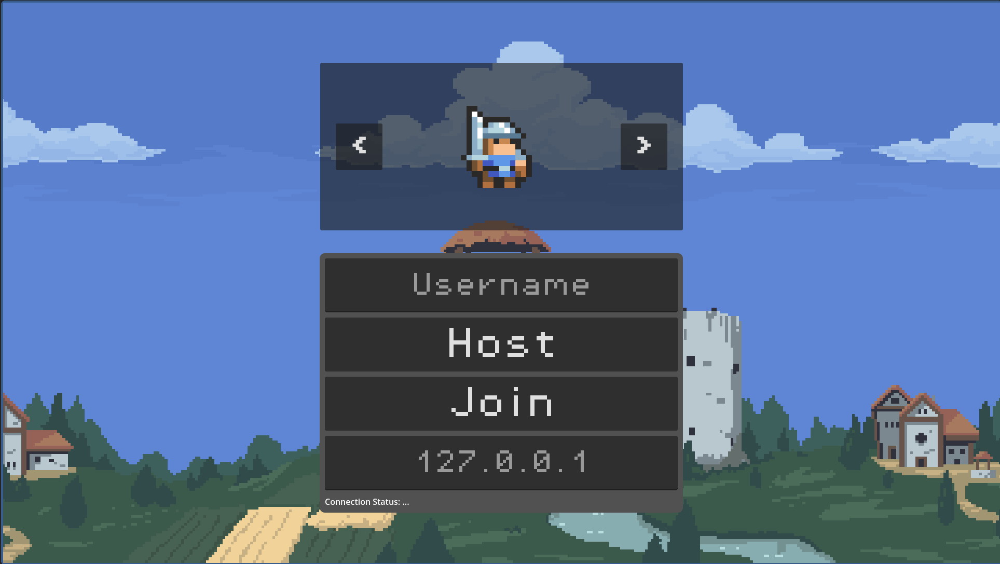
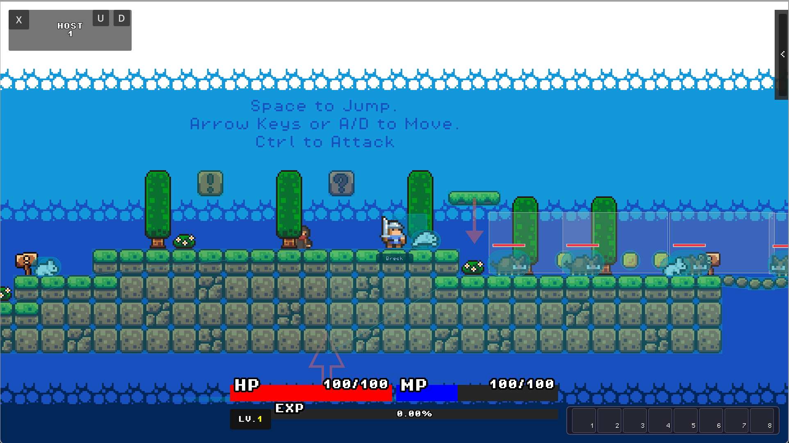
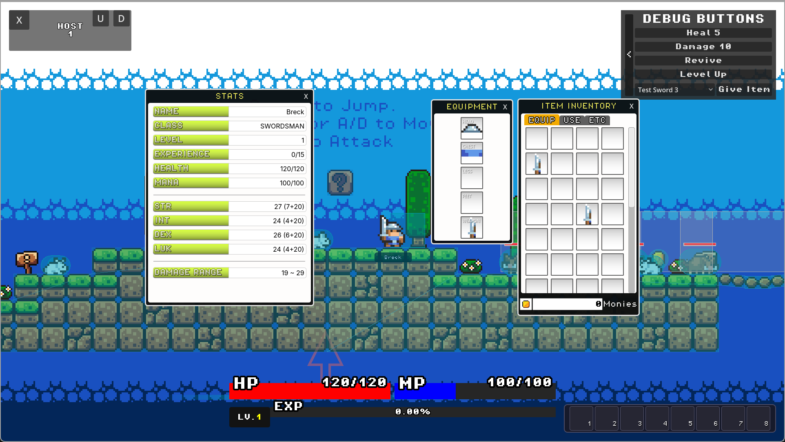
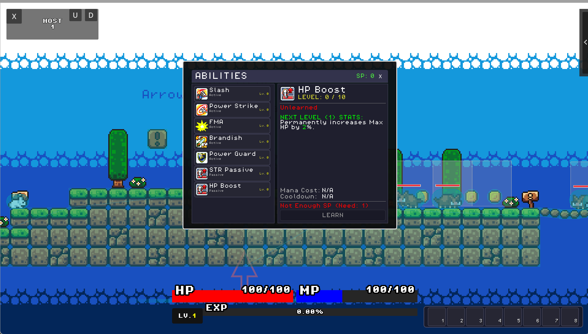

# Multiplayer Godot Project

A robust **multiplayer RPG** built with Godot Engine 4.5+ featuring server-authoritative gameplay, component-based character systems, and full backend integration (Flask + PostgreSQL). Play with friends in a persistent world with leveling, equipment, abilities, and more.

## ✅ Completed Features

### Core Multiplayer
- **Host/Join Networking**: Listen server on port 8080 with safe channel switching between ports
- **Server-Authoritative Architecture**: All state validated on server with RPC-driven client inputs
- **Account & Character System**: Account creation, character selection, persistence to PostgreSQL
- **Player Management**: Player spawning, synchronization, and cleanup

### Character Systems
- **Class System**: Swordsman, Archer, Mage with class-specific abilities and stat bonuses
- **Health & Combat**: Damage, invulnerability frames, passive regen, death/respawn, critical hits
- **Leveling System**: Experience-based progression with configurable EXP curves
- **Stats System**: STR, DEX, INT, LUCK, HEALTH, MANA, DEFENSE, CRIT CHANCE, CRIT DAMAGE, etc.
- **Equipment System**: Head, chest, legs, feet, and weapon slots with stat bonuses and visual changes

### RPG Mechanics
- **Ability System**: Active/passive abilities with cooldowns, skill points, prerequisites, stat scaling, and proc effects
- **Buff/Debuff System**: Stacking, duration tracking, custom logic hooks, stat modifiers
- **Inventory System**: Item stacking, drag-and-drop, grid-based UI, server validation
- **Consumables**: Item usage effects (heal, grant experience, etc.) with extensible effect system
- **Merchant System**: Buy/sell with unique and stackable item buyback
- **Party System**: Create, invite, join, and leave parties with shared member visibility

### World & Exploration
- **Multiple Zones**: Support for multiple maps/levels (game, game2, game3)
- **Portals & Fast Travel**: Portal-based teleportation between zones
- **Enemy AI**: State machines with idle, patrol, attack, and slash attack behaviors
- **Collectibles**: Pickup coins with animations
- **Platforms**: Drop-through platforms with collision management
- **Killzones**: Server-authoritative death triggers

### Social & Communication
- **Chat System**: In-game messaging with RPC-based broadcast
- **Friend System**: Infrastructure for friend lists and direct messaging

### User Interface
- **Advanced UI**: Draggable windows for abilities, equipment, stats, inventory, party, and chat
- **Mobile HUD**: Touch-friendly buttons for movement and actions
- **Hotbar System**: Quick-access ability bar with cooldown visualization
- **Buff Bar**: Display active buffs/debuffs with duration timers

### Data Management
- **Resource Manager**: Centralized loading and caching of abilities, items, buffs, classes
- **Player Persistence**: Save/load to JSON files with class, level, experience, equipment, inventory
- **Backend Integration**: Flask REST API for accounts, characters, party data

## Screenshots

### Main Menu


### In-Game View


### UI Systems


### Ability System


## Getting Started

### Prerequisites
- **Godot Engine** 4.5+ (Forward Plus rendering)
- **Docker & Docker Compose** (for backend/database)
- **Python 3.9+** (optional, if running backend standalone)

### Setup

1. **Clone and open in Godot**:
   ```bash
   git clone <repository-url>
   cd multiplayer-test
   godot --path .
   ```

2. **Start the backend** (required for account/character persistence):
   ```bash
   docker-compose up -d
   ```
   - Backend API: http://localhost:5000
   - Database: PostgreSQL on localhost:5432
   - Adminer (DB UI): http://localhost:8080

3. **Run the game**:
   - Press F5 in Godot to start the main scene (`scenes/UI/LoginScreen.tscn`)
   - Or run the built executable

### How to Play

**Account & Character Management**:
- Create account and login via LoginScreen
- Create or select a character
- Characters persist across sessions

**Multiplayer (Same Machine)**:
- Launch multiple instances
- Click "Host Game" (creates listen server) or "Join Game"
- Enter IP and port, then connect

**Multiplayer (Network)**:
- Host: Click "Host Game"
- Clients: Click "Join Game", enter host's IP
- Both connect to port 8080 by default

**Channel Switching**:
- Use UI arrows to switch ports (reconnects safely)
- Useful for testing with multiple servers

### Controls (Default Keybinds)
- **Move Left/Right**: A / D
- **Move Down**: S
- **Jump**: Space
- **Attack**: Left Click
- **Ability Hotkeys**: 1-5 (configurable)
- **Open Windows**: Tab (abilities), I (inventory), E (equipment), C (stats), P (party), etc.
- **Mobile**: On-screen touch buttons

All keybinds are customizable via the Options menu.

## 🛣️ Development Roadmap

### In Progress (1)
- **Equipment Upgrade/Enhancement** - Planned system for refining and enchanting gear

### High Priority - Planned (21 items)
**Visual & Audio:**
- Particle effects for combat and abilities
- Screen shake and impact feedback
- Ambient sounds and music transitions
- Visual effects for status conditions

**Content & Progression:**
- Boss encounters with multi-phase mechanics
- Mini-boss and world boss systems
- Enemy scaling with player level
- More enemy types beyond goblin/slime
- Jump Quests and platforming challenges
- Exploration rewards and discoveries
- Job Advancement system for advanced classes

**Economy & Trading:**
- Player-to-player trading
- Auction house system
- Free Market system with stall placement
- Currency system (gold, premium currency)
- Item pricing and market dynamics

**User Experience:**
- Tutorials and help system
- Accessibility features (colorblind modes, text scaling)
- Localization system
- Weather and time systems

### Blocked - Not Started (8 items)
These systems require architectural planning before implementation:
- **Guild System**: Guild creation, ranks, permissions, guild chat
- **Guild Activities**: Guild quests, raids, competitive events
- **Quest System**: Quest framework, objectives, rewards, daily/weekly quests
- **Party Quests**: Group-only quests with scaling difficulty
- **Reputation System**: NPC faction reputation with rewards
- **Achievement System**: Achievement tracking and badges

## Backend Integration

The project uses a **Flask REST API** with **PostgreSQL** for persistent data storage (accounts, characters, parties).

### Database Tables
- `accounts`: User accounts with username and hashed passwords
- `players`: Character records (name, level, class, experience, health, inventory state)
- `player_items`: Inventory items linked to players
- `player_equipment`: Equipped items per player
- `player_abilities`: Character abilities and levels
- `parties`: Party groups with timestamps
- `party_members`: Player membership in parties

### Key Endpoints
- `POST /api/accounts` - Register account
- `POST /api/login` - Authenticate and get session token
- `GET /api/players` - List characters for account
- `POST /api/players` - Create new character
- `PUT /api/players/<id>` - Update character state
- `POST /api/parties` - Create/manage parties

### Development
To add new backend features:
1. Define SQLAlchemy models in `backend/app.py`
2. Create Flask routes
3. Call from Godot using `HTTPRequest` nodes
4. Example: See `scripts/UI/LoginScreen.gd` for account creation flow

## Project Structure

*   `addons/`: Contains Godot editor plugins (e.g., `ability_editor`, `script-ide`).
*   `assets/`: Contains all of the game's visual and audio assets.
	*   `assets/fonts/`: Custom fonts used in the UI.
	*   `assets/music/`: Background music tracks.
	*   `assets/Shader/`: Custom shaders.
	*   `assets/sounds/`: Sound effects for various in-game events.
	*   `assets/sprites/`: Character, enemy, item, and UI sprites, organized by category.
	*   `assets/themes/`: UI themes.
	*   `assets/UI/`: UI-specific textures and resources.
*   `resources/`: Contains the game's data files, defined as custom Godot resources (`.tres`).
    *   `resources/Abilities/`: Definitions for all in-game abilities (`AbilityData`, `AbilityLevelData`, `AbilityScalingData`, `ProcEffectData`, `StatBonusFormula`).
    *   `resources/Buffs/`: Definitions for all in-game buffs and debuffs (`BuffData`).
    *   `resources/DropTables/`: Configuration for item drops from enemies.
    *   `resources/Items/`: Definitions for all in-game items (`ItemData`, `EquipmentData`, `ArmorData`, `WeaponData`, `ItemDropResource`).
    *   `resources/Player/`: Player-specific resources.
        *   `resources/Player/Classes/`: Definitions for different player classes (`ClassData`).
        *   `resources/Player/SpriteFrames/`: SpriteFrames resources for player animations.
*   `scenes/`: Contains the game's scenes, the building blocks of levels and UI.
	*   `scenes/Collectables/`: Scenes for collectible items (e.g., `coin.tscn`).
	*   `scenes/Gameplay/`: General gameplay elements (e.g., `dropped_item.tscn`, `enemy_spawner.tscn`).
	*   `scenes/Levels/`: Main game levels (e.g., `main_menu.tscn`, `game.tscn`).
	*   `scenes/NPC/`: Non-player character scenes.
	*   `scenes/Player/`: Player character scenes and related elements.
	*   `scenes/Tools/`: Utility scenes.
	*   `scenes/UI/`: User interface scenes (e.g., `ability_slot.tscn`, `hotbar_slot.tscn`, `slot.tscn`).
*   `scripts/`: Contains the game's GDScript files, defining all game logic.
    *   `scripts/AbilityLogic/`: Custom logic scripts for complex ability behaviors (e.g., `AL_EnhancedBasics.gd`, `AL_SlashBlast.gd`).
    *   `scripts/BuffLogic/`: Custom logic scripts for complex buff behaviors (e.g., `BL_MapleWarrior.gd`, `BL_PowerGuard.gd`).
    *   `scripts/Components/`: Reusable components attached to game entities (e.g., `ability.gd`, `buff.gd`, `class.gd`, `combat.gd`, `debug.gd`, `equipment.gd`, `health.gd`, `inventory.gd`, `level.gd`, `merchant_inventory.gd`, `player_inventory.gd`, `stats.gd`).
    *   `scripts/Enemy/`: Enemy-specific scripts.
        *   `scripts/Enemy/StateMachine/`: State scripts for enemy AI (e.g., `enemy_attack.gd`, `enemy_idle.gd`, `enemy_patrol.gd`).
        *   `scripts/Enemy/enemy_base.gd`: Base class for all enemies.
        *   `scripts/Enemy/enemy_spawner.gd`: Manages enemy spawning and pooling.
    *   `scripts/Enums/`: Global enumerations (`constants.gd`).
    *   `scripts/Managers/`: Autoloaded singletons for global game systems (e.g., `game_manager.gd`, `multiplayer_manager.gd`, `resource_manager.gd`, `keybind_manager.gd`, `user_config.gd`).
    *   `scripts/Networking/`: Scripts handling multiplayer networking logic (e.g., `channel_manager.gd`, `client_manager.gd`, `network_utils.gd`, `player_manager.gd`, `server_manager.gd`).
    *   `scripts/NPC/`: Non-player character logic (e.g., `npc_interaction.gd`).
    *   `scripts/Player/`: Player-specific scripts.
        *   `scripts/Player/StateMachine/`: State scripts for player character behavior (e.g., `attack.gd`, `crouch.gd`, `death.gd`, `fall.gd`, `hit.gd`, `idle.gd`, `jump.gd`, `move.gd`, `slide.gd`).
        *   `scripts/Player/multiplayer_controller_v2.gd`: The main player character script.
        *   `scripts/Player/multiplayer_input.gd`: Handles player input synchronization.
        *   `scripts/Player/player_hud.gd`: Manages player HUD elements.
    *   `scripts/Resources/`: Base classes for custom resource types (e.g., `AbilitySystem`, `BuffSystem`, `ClassSystem`, `ItemSystem`, `StatSystem` subdirectories).
    *   `scripts/StateMachine/`: Generic state machine implementation (`state.gd`, `state_machine.gd`).
    *   `scripts/UI/`: Scripts for user interface elements (e.g., `ability_slot.gd`, `ability_window.gd`, `buffbar.gd`, `equipment_slot.gd`, `equipment_window.gd`, `global_drop_handler.gd`, `hotbar.gd`, `hotbar_slot.gd`, `inventory_window.gd`, `shop_window.gd`, `slot.gd`, `stats_window.gd`, `game_menu.gd`, `keybinds_menu.gd`, `options_menu.gd`).
    *   `scripts/coin.gd`: Logic for collectible coins.
    *   `scripts/damage_numbers.gd`: Manages floating damage numbers.
    *   `scripts/killzone.gd`: Logic for kill zones.
    *   `scripts/main_menu.gd`: Main menu logic.
    *   `scripts/platform.gd`: Logic for platforms.
*   `backend/`: Flask REST API for account and character persistence.
    *   `backend/app.py`: Main Flask application with database models and API endpoints.
    *   `backend/requirements.txt`: Python dependencies.
    *   `backend/Dockerfile`: Container image for backend.
*   `docker-compose.yml`: Docker Compose configuration for PostgreSQL, Flask API, and Adminer.
*   `README/`: Project documentation and screenshots

## Multiplayer Architecture

### Managers

- **multiplayer_manager.gd**
  - Signals: `server_has_started`, `channel_switch_started/success/failed`
  - Config: `DEFAULT_PORT` (8080), `DEFAULT_IP` (127.0.0.1)
  - Public API: `host_game()`, `join_game()`, `switch_channel(port)`, `reset_data()`, `change_level(scene)`
  - Behavior: initializes signal wiring to Client/Server/Channel managers; hides/shows menu UI; tracks `host_mode_enabled` and `respawn_point`; returns to main menu on disconnect; starts dedicated server when the `dedicated_server` feature is present

- **server_manager.gd**
  - Signals: `server_started`, `server_failed`
  - Public API: `start_listen_server(port)`, `start_dedicated_server(port)`, `stop_server()`, `get_current_port()`, `get_server_info()`
  - Behavior: owns the `ENetMultiplayerPeer` for the server; sets `multiplayer.multiplayer_peer`; retries ports for dedicated server up to a small cap

- **client_manager.gd**
  - Signals: `connection_succeeded`, `connection_failed`
  - Public API: `connect_to_server(ip, port)`, `cleanup()`/`_disconnect()`, `get_connection_info()`, `get_connection_status()`, `create_new_peer(ip, port)`
  - Behavior: owns the client `ENetMultiplayerPeer`; sets `multiplayer.multiplayer_peer`; tracks current IP/port and connection timestamps; emits results consumed by `MultiplayerManager`

- **player_manager.gd**
  - State: `active_players: { id -> {character_type, spawn_time, synced} }`
  - Public API: `add_host_player()`, `add_player(id)`, `remove_player(id)`, `cleanup()`, `force_respawn_player(id)`, info getters
  - Behavior: on join, requests client character selection via RPC, spawns the chosen character under `Level/Players`, syncs existing networked entities to the new peer, and updates tracking; removes entities on disconnect

- **resource_manager.gd**
  - Centralized resource loading and caching system
  - Manages: `class_data`, `item_data`, `ability_data`, `buff_data` dictionaries
  - Public API: `get_item_data()`, `get_ability_data()`, `get_buff_data()`, `get_class_data()`
  - Behavior: loads all game resources on startup; provides ID and name-based lookups; supports both UUID and string identifiers

- **music_manager.gd**
  - Audio management for background music and sound effects
  - Public API: `play_song(path)`
  - Behavior: handles audio stream loading and playback

### Networking

- **channel_manager.gd**
  - Signals: `switch_started`, `switch_success`, `switch_failed`
  - Public API: `switch_channel(new_port)`, `is_switching()`, `get_switch_progress()`
  - Behavior: tests reachability of the target port, cleans up entities, disconnects, creates a new client peer, waits for connection (with timeouts), updates UI PID; on failure, returns to main menu

- **network_utils.gd**
  - Validation: `is_valid_ip(text)`, `is_valid_port(port)`, `is_port_in_range(...)`
  - CLI: `get_port_from_args(default)`, `get_string_arg(name)`, `has_flag(name)`
  - Scene helpers: `get_players_spawn_node(tree)`, `get_node_safe(node, path)`
  - Cleanup/logging/testing: `clear_networked_entities(tree)`, `log_network_event(...)`, `test_tcp_connection(ip, port)`

### Player Controller

- **multiplayer_controller_v2.gd**
  - Role: authoritative character controller
  - Exports references to Health/Combat/Leveling/Stats/Class/Debug and UI
  - Server duties: processes input/state via state machine, manages facing/animations, death/respawn, persistent save/load (`player_<username>.json`), class/sprite changes, drop-through logic, and cleanup before removal (for channel switching)
  - Client duties: shows HUD and camera for local player; requests sprite state and data from server

- **multiplayer_input.gd**
  - Role: local-authority `MultiplayerSynchronizer`
  - Samples input, mirrors facing direction
  - RPCs `jump()`, `attack()`, and `drop()` to the server
  - Provides cleanup to avoid stale references

### Host/Join Flow

**Host Flow:**
Main Menu → `MultiplayerManager.host_game()` → `ServerManager.start_listen_server()` → `server_started` → connect peer signals → load `game.tscn` → `PlayerManager.add_host_player()` → spawn under `Level/Players`

**Join Flow:**
Main Menu → `MultiplayerManager.join_game()` → `ClientManager.connect_to_server()` → `connected_to_server` → hide menu and show connection panel → `PlayerManager._request_character_selection` → server spawns chosen character

## Component Systems

The player and enemies are composed from small, focused components that live as child Nodes on the character scene. All state-changing logic executes on the server; clients submit intent only.

- Health (`scripts/Components/health.gd`)
  - Exports: `max_health`, `health_bar_path` to a `ProgressBar` UI, `damage_number_origin` for damage display.
  - Signals: `health_changed(current, max)`, `damaged(amount, source)`, `died(killer)`.
  - RPCs: `take_damage(amount, source, ignore_invuln, is_crit)`, `heal_damage(amount, source)`, `die()`. Guarded so only the server mutates.
  - Features: 1s invulnerability after damage; passive regen every 10s based on HPREGEN stat; damage number display; integrates with StatsComponent for max_health calculation.
  - Death/Respawn: sets `is_dead`, emits `died`, and expects the controller to call `respawn()` which restores health to max.

- Stats (`scripts/Components/stats.gd`)
  - Comprehensive stat system with base stats, equipment bonuses, ability bonuses, and buff bonuses.
  - Stats: STRENGTH, DEXTERITY, INTELLIGENCE, LUCK, HEALTH, MANA, HPREGEN, DEFENSE, CRITCHANCE, CRITDAMAGE, WEAPONATTACK, MAGICATTACK.
  - Integration: reacts to LevelingComponent, ClassComponent, EquipmentComponent, AbilityComponent, and BuffComponent changes.
  - Features: automatic stat recalculation, loading mode support, server-client synchronization.
  - Signals: `stats_changed` emitted when stats are recalculated.

- Leveling (`scripts/Components/level.gd`)
  - Signals: `experience_changed(current, exp_to_level)`, `leveled_up(new_level)`.
  - Exports: `max_level`, `level_curve` for EXP requirements.
  - RPC: `add_exp(amount)`; increments EXP, loops level-ups while enough EXP remains.
  - Features: curve-based EXP system, automatic level progression.

- Class (`scripts/Components/class.gd`)
  - Enum-backed class selection: Swordsman, Archer, Mage.
  - Features: class-specific abilities, base stats, stat bonuses, sprite frames.
  - Integration: loads abilities from ResourceManager, provides class data to other components.
  - RPC: `change_class_rpc(new_class)` for server-authoritative class changes.
  - Signals: `class_changed(new_class)` triggers stat recalculation.

- Combat (`scripts/Components/combat.gd`)
  - Dual attack system: basic attacks and ability attacks with different damage calculations.
  - Features: hitbox management, target limiting, hit counting, damage variance, critical hits.
  - Integration: works with StatsComponent, ClassComponent, EquipmentComponent, AbilityComponent.
  - Basic attacks: weapon-based damage with stat scaling and equipment bonuses.
  - Ability attacks: ability-specific damage with passive modifiers and target/hit limits.
  - Damage display: integrates with damage number system for visual feedback.

- Ability (`scripts/Components/ability.gd`)
  - Manages character abilities including learning, leveling, usage, cooldowns, and passive effects.
  - Signals: `ability_used`, `cooldown_started`, `ability_leveled_up`, `ability_learned`, `ability_points_changed`.
  - Features: skill point system, ability prerequisites, passive stat bonuses, proc effects, multiplayer synchronization.
  - Integration: works with ClassComponent, StatsComponent, and LevelingComponent.

- Buff (`scripts/Components/buff.gd`)
  - Manages temporary and permanent buffs/debuffs with stat modifications and custom logic.
  - Signals: `buff_applied`, `buff_removed`, `buff_refreshed`.
  - Features: stacking behavior (refresh/stack/ignore), duration tracking, custom script execution.
  - Integration: provides stat modifiers to StatsComponent, supports reactive buffs on damage events.

- Equipment (`scripts/Components/equipment.gd`)
  - Manages character equipment slots (head, chest, legs, feet, weapon) with type restrictions.
  - Signals: `on_equipment_changed`.
  - Features: equipment type validation, stat bonus application, visual changes.
  - Integration: works with InventoryComponent for item management and StatsComponent for stat bonuses.

- Inventory (`scripts/Components/inventory.gd`)
  - Comprehensive item management system with stacking, drag-and-drop, and server validation.
  - Features: item tracking, stack management, equipment integration, multiplayer synchronization.
  - UI: supports multiple inventory grids, equipment slots, currency display.
  - Networking: client-side optimistic updates with server validation and rollback on conflicts.

- Debug (`scripts/Components/debug.gd`)
  - Dev-only panel with buttons to heal, damage (ignoring invuln), force revive, and grant EXP to next level.
  - Hooks into the player via `set_player()` and health via `set_health_component()`.

- Component test (`scripts/Components/component_test.gd`)
  - Utility for verifying wiring in scenes; prints summaries for Class, Stats, Leveling, Health, and Combat and supports quick class/level tests.

Component wiring guidelines
- Put these as children on the character root (e.g., `Player/Health`, `Player/Stats`, `Player/Leveling`, `Player/Class`, `Player/Combat`, `Player/Ability`, `Player/Buff`, `Player/Equipment`, `Player/Inventory`).
- In `MultiplayerPlayerV2`, set the exported references (`health_component`, `combat_component`, `level_component`, `stats_component`, `class_component`, `debug_component`, `ability_component`, `buff_component`, `equipment_component`, `inventory_component`).
- Health: set `health_bar_path` to your HUD ProgressBar and `damage_number_origin` for damage display.
- Stats: requires LevelingComponent, ClassComponent, EquipmentComponent, AbilityComponent, and BuffComponent for full functionality.
- Combat: assign `attack_hitbox` and configure weapon_multiplier; integrates with multiple components for damage calculation.
- Ability: requires ClassComponent and StatsComponent siblings; connects to LevelingComponent for skill points.
- Buff: requires StatsComponent sibling; connects to HealthComponent for reactive buffs.
- Equipment: configure slot references (head_slot, chest_slot, legs_slot, feet_slot, weapon_slot).
- Inventory: configure inventory_grids array and equipment_component reference.

Example wiring
```gdscript
# In the Inspector for CombatComponent
attack_hitbox = $"../../Hitbox/BasicAttackHitbox"
weapon_multiplier = 1.2  # Adjust based on weapon type

# In the Inspector for HealthComponent
health_bar_path = NodePath("../../CanvasLayer/PlayerHUD/HealthBar")
damage_number_origin = $"../../DamageNumberOrigin"

# In the Inspector for StatsComponent
# Stats are automatically configured, but ensure proper component references
```

## UI Systems

The project includes comprehensive UI systems for managing character progression and equipment:

- **Ability Window** (`scripts/UI/ability_window.gd`)
  - Draggable window for managing character abilities and skill points.
  - Features: ability list, detailed stats comparison, level-up interface, prerequisite checking.
  - Controls: `OpenAbilityWindow` input action toggles visibility.
  - Integration: connects to AbilityComponent for real-time updates.

- **Equipment Window** (`scripts/UI/equipment_window.gd`)
  - Draggable window for character equipment management.
  - Features: equipment slots visualization, drag-and-drop support.
  - Controls: `OpenEquipmentWindow` input action toggles visibility.
  - Integration: works with EquipmentComponent and InventoryComponent.

- **Stats Window** (`scripts/UI/stats_window.gd`)
  - Draggable window displaying comprehensive character statistics.
  - Features: real-time stat updates, base/bonus breakdown, damage range display.
  - Controls: `OpenStatsWindow` input action toggles visibility.
  - Integration: connects to multiple components (Stats, Level, Health, Class) for live updates.

- **Inventory Window** (`scripts/UI/inventory_window.gd`)
  - Comprehensive item management interface.
  - Features: grid-based inventory, equipment slots, drag-and-drop, stack management.
  - Integration: works with InventoryComponent and EquipmentComponent.

- **Hotbar System** (`scripts/UI/hotbar.gd`, `scripts/UI/hotbar_slot.gd`)
  - Quick-access ability bar for active abilities.
  - Features: cooldown visualization, ability assignment, key binding support.
  - Integration: connects to AbilityComponent for ability usage.

- **Buff Bar** (`scripts/UI/buffbar.gd`)
  - Visual display of active buffs and debuffs.
  - Features: buff icons, duration timers, stack indicators.
  - Integration: connects to BuffComponent for real-time updates.

## Resource Systems

The project includes comprehensive resource management for game data:

- **Resource Manager** (`scripts/Managers/resource_manager.gd`)
  - Centralized loading and caching of all game resources.
  - Manages: class data, item data, ability data, buff data.
  - Features: ID and name-based lookups, automatic resource loading on startup.
  - Public API: `get_item_data()`, `get_ability_data()`, `get_buff_data()`, `get_class_data()`.

- **Ability System Resources** (`scripts/Resources/AbilitySystem/`)
  - `AbilityData.gd`: Core ability resource with scaling formulas and level data.
  - `AbilityLevelData.gd`: Per-level ability statistics and scaling.
  - `AbilityScalingData.gd`: Mathematical formulas for ability progression.
  - `ActiveBehaviorData.gd`: Active ability behavior configuration.
  - `ProcEffectData.gd`: Passive ability proc effect definitions.

- **Buff System Resources** (`scripts/Resources/BuffSystem/`)
  - `BuffData.gd`: Buff/debuff resource with stat modifiers and custom logic.
  - Features: stacking behavior, duration, custom script execution.

- **Item System Resources** (`scripts/Resources/ItemSystem/`)
  - Comprehensive item management with equipment, consumables, and currency.
  - Features: item types, stacking, equipment slots, stat bonuses.

- **Class System Resources** (`scripts/Resources/ClassSystem/`)
  - `ClassData.gd`: Character class definitions with stat bonuses and abilities.
  - Features: class-specific skills, sprite frames, stat growth.

- **Ability Logic Scripts** (`scripts/AbilityLogic/`)
  - Custom ability execution scripts for active abilities.
  - Examples: `AL_EnhancedBasics.gd`, `AL_PowerGuard.gd`, `AL_SlashBlast.gd`.
  - Integration: executed by AbilityComponent during ability usage.

- **Buff Logic Scripts** (`scripts/BuffLogic/`)
  - Custom buff behavior scripts for reactive effects.
  - Examples: `BL_PowerGuard.gd` for damage reflection.
  - Integration: executed by BuffComponent for custom buff logic.

### Character selection and sprites
- Characters available: Swordsman, Archer, Mage (select in main menu).
- The server applies class changes and picks the best sprite set based on the player level.
  - Sprite frames are chosen per class based on level thresholds (e.g., 1 and 15).
  - New clients receive the current sprite state on connect to ensure visual consistency.

### Networking notes
- Server is authoritative for movement, combat, health, abilities, buffs, equipment, and respawn logic.
- Clients send intent (jump/attack/down/ability_use) via RPCs; the server simulates and replicates.
- Networked entities are tagged with the `networked_entities` group for consistent cleanup.
- When a new player joins, existing entities can sync their state just to that peer (e.g., current animation/state).
- Main menu UI is updated on host/join to show connection status and the player's unique ID.

### New System Networking
- **Ability System**: Server-authoritative ability usage with client-side cooldown display. Ability points and levels are synchronized via RPCs.
- **Buff System**: Server manages buff application/removal with client-side visual updates. Buff stacks and durations are synchronized.
- **Equipment System**: Server validates equipment changes with client-side optimistic updates and rollback on conflicts.
- **Inventory System**: Client-side optimistic item movement with server validation. Inventory state is synchronized on connect and changes.
- **Resource Management**: All resource data is loaded server-side and synchronized to clients on connection.

### Scene requirements
- The gameplay scene should have a `Level` node with a `Players` child; spawns are added under `Level/Players`.
- A UI node named `%MenuContainer` must exist in the main menu for host/join controls and player name entry.
  - It provides: `selected_character`, `get_username()`, and `setup_PID_label(is_host, pid)` used by the managers.

### Persistence
- On the server, player data is saved to `player_<username>.json` via RPCs from `multiplayer_controller_v2.gd`.
- When a player joins, the server will load their file if present and update components (health, level, exp, abilities, buffs, equipment, inventory).
- Delete the corresponding `player_<username>.json` file to reset progress.

Details:
- Save triggers on server when health changes, experience/level changes, ability changes, equipment changes, or inventory changes.
- Persisted fields include: `username`, `max_health`, `current_health`, `level`, `experience`, `ability_levels`, `ability_points`, `active_buffs`, `equipment`, `inventory_slots`, `monies`.
- **Ability System**: Saves ability levels, available skill points, and hotbar configuration.
- **Buff System**: Saves active buffs with stacks and remaining duration.
- **Equipment System**: Saves equipped items in each slot.
- **Inventory System**: Saves all inventory slots with items and stack amounts, plus currency.

### Dedicated Server
- `multiplayer_manager.gd` will start a dedicated server if the build has the `dedicated_server` feature.
- Port selection supports a `--port <number>` command-line argument (default 8080).
- Typical usage: run a dedicated-server export or add the `dedicated_server` feature and launch headless with `--port 8080`.
Example (headless):
```
godot --headless --feature dedicated_server --path . -- --port 8080
```

### Channel switching details
- Clients can change channels (ports) without restarting the game.
- The flow is: test reachability of the new port → clean up local entities → disconnect → create a new ENet client → wait for connection or timeout → update UI with new PID.
- Timeouts: quick reachability test (~2s) and connection establishment (~8s) guard against stalls.
- On failure, the client is returned to the main menu with an error message.

### Health & kill/respawn details
- HealthComponent emits: `health_changed`, `damaged`, `died`.
- Invulnerability frames: ~0.5s after taking damage; subsequent hits during this window are ignored unless forced.
- Passive regeneration: every ~5s restores ~10% of max health (server-side, only when alive).
- Killzones: server checks if the body is a `MultiplayerPlayerV2` and calls `die.rpc()` to trigger the death sequence.
- Respawn: server sets the player position to `MultiplayerManager.respawn_point` and restores full health.

### Input & dropping through platforms
- The input synchronizer runs only for the local authority and sends intent to the server.
- Drop-through: hold `Move Down` and press `Jump` to pass through drop-through platforms. The player temporarily disables collision with the platform's layer.

### Autoload singletons (expected)
- `MultiplayerManager`, `ServerManager`, `ClientManager`, `PlayerManager`, `ChannelManager`, `NetworkUtils`, `ResourceManager`, `MusicManager` should be configured as AutoLoads and accessible globally.

## Credits

- Built with [Godot Engine](https://godotengine.org/)
- Art and sound assets from [Kenney.nl](https://kenney.nl/) and other open sources

## License

This project is for educational and demonstration purposes. See individual asset folders for specific licenses.
