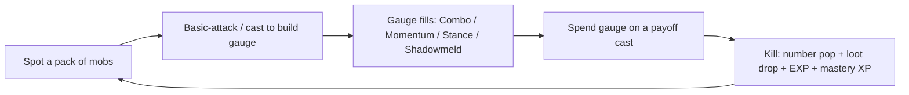
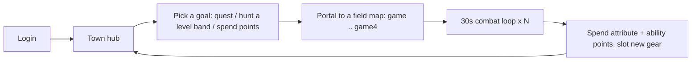
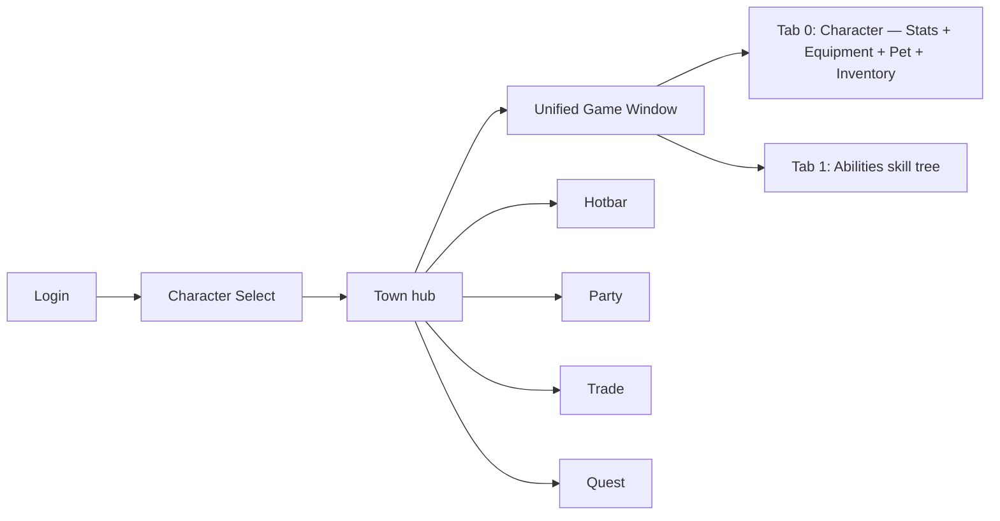

# Emberwilds — Game Design Document

> **Version:** v0.9 — systems-complete draft
> **Last updated:** 2026-06-02
> **Owner:** Breck Palmateer
> **Status:** Vertical slice — core systems implemented in code (`feat/weapon-identity-overhaul`, overhaul folder), live end-to-end validation pending.

---

> **Reading note.** This GDD documents the **weapon-identity overhaul** as it
> actually exists in code today (folder `multiplayer-test-overhaul/`), not the
> abandoned PR-4 WIP in the base repo. Where this supersedes the older
> [`docs/v1_design_summary.html`](v1_design_summary.html), it does so because
> that plan has now largely **shipped** — 80 abilities, four weapon gauges, the
> manual attribute pool, and the unified game window are all in the build.

## 1. Executive summary

**Emberwilds** is a **server-authoritative 2D side-scrolling co-op RPG** where
your **weapon is your class**. There are no job classes to pick — you wield a Sword, Bow, Staff,
or Dagger, level that weapon's *mastery*, and spend freely-allocated attribute
points to shape a STR tank, a DEX marksman, an INT mage, a LUCK assassin, or any
hybrid in between. Equip **two** weapons at once and your build is the
intersection of their two ability trees.

The fantasy is **MapleStory's chunky 2D hunting** crossed with **New World's
weapon-driven identity** and **Diablo-style branching ability upgrades**. You
hunt packs of mobs through portal-connected maps, watch numbers pop, fill a
signature weapon gauge (sword Combo, bow Momentum, staff Element Stance, dagger
Shadowmeld), and cash it into a payoff. Friends host a lobby and drop in; bots
fill out the party and the world.

- **One-line pitch:** A 2D co-op hunting RPG where your *weapon* is your class — master it, dual-wield it, and rebuild it through branching upgrade trees.
- **High concept:** Pick up a sword and you *are* a vanguard; swap to a dagger and you're an assassin — identity flows from the weapon in your hand and the attribute points you pour into it, not from a class you chose at character creation. Two weapon slots, four signature gauges, and 80 abilities with 343 upgrade variants make every build feel hand-assembled.
- **Reference points:** MapleStory (2D hunting feel, silhouette-legible sprites), New World (weapon-driven identity + freely-allocated attributes with utility breakpoints), Ragnarok Online (card-style gear identity, target audience), Diablo 4 (3-tier ability upgrade trees with mutually-exclusive variants), Last Epoch (ability transformation depth), Erenshor (bots-as-population).

## 2. Design pillars

1. **The weapon is the class.** Every identity decision routes through *which weapon you wield* and *how you've mastered it*. A feature that reintroduces fixed job-classes, or that makes the weapon cosmetic, violates this pillar. (Enforced in code: `ClassComponent` was deleted — [ADR 0004](adr/0004-classcomponent-removal-weapon-discipline.md).)
2. **Build it yourself.** Attributes are freely allocated (5 points/level), abilities are freely leveled, and every ability has a branching upgrade tree whose Tier-3 variants *change how it plays* — never just "+30% damage." If a choice is a stat slider, it's the wrong choice.
3. **Distinct shapes, not reskins.** Each weapon owns a different *mechanical shape* (build-and-spend combo, ramp-and-snipe momentum, element stances, stealth windows) and a different stat axis (Defense / Accuracy / Magic Attack / Evasion). Two abilities that play identically with different names are a bug.
4. **Server owns the truth.** Clients send intent; the server validates, mutates, and broadcasts. Health, stats, drops, abilities, and progression never trust a client. This is the multiplayer moat.
5. **Co-op is "farm faster together," not "fill a trinity."** Parties hunt faster and roles emerge from weapon identity — there is no enforced tank/healer holy trinity, no ally-targeted heals, no enemy party-scaling.

> ⚠ Open question: Pillars 2 and 5 are in tension at endgame — a 495-point attribute pool plus 100 ability points plus 343 upgrades is a *lot* of build freedom, but the co-op loop currently has no content that *demands* a coordinated build (no boss mechanics, no role gates). See §11 and §19.

## 3. Game overview

| Field | Value |
|---|---|
| Genre | 2D side-scrolling co-op MMORPG-lite |
| Sub-genre | Server-authoritative weapon-driven action RPG + grind |
| Engine | Godot 4.5+ (Forward Plus) |
| Platforms | Windows first; Linux/Mac feasible (Godot export) |
| Network model | Server-authoritative; clients send intent via RPC; server is always peer ID 1 |
| Topology | Steam-lobby co-op is the north star; **ENet + Flask/PostgreSQL is the current dev/test topology**; a Breck-hosted official server is a later opt-in |
| Players per session | Host + friends, party size effectively uncapped; **Bots** fill out party and population |
| Session length | ~20–45 min hunting sessions; come back for the next mastery rank / gear upgrade |
| Target audience | Players who loved MapleStory/Ragnarok hunting and want New-World build freedom in 2D co-op |
| Rating target | T — fantasy violence, no gore |
| Monetisation | None planned for v1 (passion/portfolio project); cosmetic-only if ever |

## 4. Player experience goals

- **Moment-to-moment (seconds):** every hit lands with a clear number pop and a mastery-floored damage roll (min damage = 20% of max, so even low rolls feel like progress); the weapon gauge visibly fills on the screen edge, building toward a payoff cast.
- **Session (minutes):** "one more rank" — I left the hunt with my Sword mastery ticking toward the next ability point, a new attribute point or two, and maybe a rarer drop with a `CRITDAMAGE` roll I want to slot.
- **Long-term (hours/days):** my Sword/Staff spellblade plays nothing like my friend's pure Dagger crit-assassin, because we spent attributes, ability points, and Tier-3 upgrade variants in completely different directions — and respeccing is free, so I can rebuild around a new weapon without re-grinding.

## 5. Core loops

### 5.1 30-second loop



The decision beat is **build vs. spend the gauge**: hold combo for a bigger
Sundering Blow, or dump now for AoE? Snipe at 10 Momentum stacks or keep firing?
The payoff beat is the kill — EXP toward character level, mastery XP toward the
wielded weapon's next ability point, and a FFA drop.

### 5.2 Session loop



### 5.3 Meta loop (week-over-week)

Push a weapon's **mastery toward 100** (≈ character level 70) to finish its
ability tree → respec **attributes** and **upgrade variants** around a new
playstyle → pick up a **second weapon discipline** (a sword main dipping Staff
for spellblade) → chase higher-level-band gear with better `CRITDAMAGE` /
`WEAPONATTACK` rolls up the enemy ladder toward the **Eternal Warlord (L100)**.

## 6. Story, setting & world

> Full world bible: [`docs/LORE.md`](LORE.md). This section is the GDD-level
> summary and how the fiction maps onto the systems.

### 6.1 Setting — the Emberwilds

Generations ago the **Weave** — the lattice that held all magic — **shattered**.
That night, remembered as **the Emberfall** (scholars call it *the Sundering*),
its power rained down as **embers**: glowing, elemental shards of broken magic.
The old kingdoms fell with the Weave, and raw embers warped the beasts of the
deep woods into monsters.

The survivors rebuilt. They raised **Hearths** — warm frontier towns ringed by
**ember-lanterns** that hold the wild at bay (the safe hubs / `town`) — and
learned the one art the old world never needed: an ember can't be wielded
barehanded, but **bound into a weapon, it can be channelled**. Past the
lantern-light lie **the Emberwilds**: overgrown fields, goblin-held woods,
drowned mines, and the ruins of the world that broke — still saturated with
embers to harvest and the monsters they keep warping. That is the loop:
**venture out, gather embers, deepen your attunement, push the wild back.**

The world is a **Hearth ringed by portal-connected wild maps** (§12), capped by
the deepest ruin and its keeper, the **Eternal Warlord** (§6.3).

**Fiction → systems:**

| Fiction | System |
|---|---|
| Magic only channels **through an attuned weapon** | The weapon *is* the class (§7.2) |
| **Embers** come in elements | Fire/Ice/Lightning/Earth/Wind/Shadow/Arcane (staff stances, §8) |
| **Attunement** deepens with use | Weapon mastery (§9.5) |
| **Sigils** — crystallised Weave-fragments you slot | Card/rune-style gear identity (§10) |
| **Wilders** run the deep wilds together | Co-op parties (§13) |
| The wilds are still ember-saturated | Endless respawns / the grind (§5.3) |
| **Hearthfolk** — a lived-in frontier | Bots-as-population (§11.3) |

### 6.2 Tone — cozy catastrophe

The apocalypse already happened, and the world *survived it*. **Hopeful, not
grim:** days are spent in a warm town among people who know your name; danger
lives at the edges and in the deep. MapleStory's readable, cheerful 2D
silhouettes drift to a muted high-fantasy palette as you climb toward the ruins.
Combat stays energetic and number-forward — campfire at the center, monsters at
the edges.

### 6.3 Plot beats (high level)

> The narrative is delivered by the quest chains (§14); below is that guided
> journey told in Emberwilds fiction. The plot is intentionally light — the
> *world* is authored; the *epic* is still optional.

- **Act 1 — past the lantern-line (lvl 1–10):** a Hearth elder sends you out —
  auto-granted `q_first_blood` (your first kill) → a WelcomeOverlay → the
  Slime/Bunny near-wilds chains. You **attune** to your starting weapon and learn
  its gauge.
- **Act 2 — into the deep (lvl 10–30):** the **Deep Woods** / goblin chains open;
  the Advancement chain (`q_call_to_advance`) points you toward the old ruins,
  where embers run richer and a **second attunement** becomes worth the risk.
- **Act 3 — the heart of the Sundering (lvl 30–100):** mastery caps (~L70); the
  climb to 100 is refinement of attributes, sigils, and gear as you delve the
  oldest ruins. At the bottom waits the **Eternal Warlord** — an old-world general
  who bound so many embers he became deathless and warped, and who will not let
  the Weave's heart be touched. *(Whether to mend the Weave or leave it broken is
  the question the Hearths still argue over.)*

### 6.4 Regions

| Region (map_id) | Level band | Vibe (Emberwilds) | Notable mobs |
|---|---|---|---|
| `town` | — | **Lantern's Rest** — the starting Hearth, safe hub ringed by ember-lanterns | Quest-giver Hearthfolk, no combat |
| `game` | ~1–3 | The **near-wilds** — overgrown fields just past the lantern-line | Slime (1), Bunny (1), Bird (3) |
| `game2` | ~6–9 | Wilder **ember-meadows** | Boar (6), Deer (7), Fox (9) |
| `game3` | ~10–23 | The **Deep Woods** — goblin-held, ember-thick | Goblin Warrior (13), Goblin (18), Cave Goblin (23) |
| `game4` | ~28+ | The **Ruins** — the broken old world, toward the Warlord | Tusk Brute (28) and upward |

## 7. Characters & disciplines

### 7.1 Player character

- **Identity surface:** at character creation the player picks a **starting weapon discipline** (Sword/Bow/Staff/Dagger), which seeds the sprite, the HP/MP curve, the base stats, and the first ability point (via `WeaponMasteryComponent.bootstrap_chosen_discipline()` bumping that discipline's mastery 0→1). Everything after is earned and freely re-allocated.
- **Visual constraint (load-bearing):** there are **four static sprites** (swordsman / archer / mage / rogue), no paperdoll, no art budget for more. This constraint is *why* identity is weapon-and-build-driven rather than visual — build variety is expressed through ability FX, the gauge widgets, and numbers, not character art.

### 7.2 Weapon disciplines (there are no classes)

`Constants.ClassType` is renamed to the four disciplines (`SWORD=0, BOW=1,
STAFF=2, DAGGER=3`; legacy advanced classes 5–8 are normalized back to tier-1 on
load). `WeaponMasteryComponent` owns the `primary_discipline` pointer and the
per-discipline mastery levels. The **active** discipline (the weapon currently
wielded) drives damage scaling — *"I am my weapon."*

| Discipline | Primary stat (×4) | Secondary (×1) | Stat axis (utility) | Signature gauge |
|---|---|---|---|---|
| **Sword** | STR | DEX | Defense | **Combo** (build to 3, spend) |
| **Bow** | DEX | STR | Accuracy | **Momentum** (ramp to 10 stacks) |
| **Staff** | INT | LUCK | Magic Attack | **Element Stance** (Fire/Ice/Lightning) |
| **Dagger** | LUCK | DEX | Evasion | **Shadowmeld** (stealth windows) |

**Spellblade:** when a Staff is the active weapon, the primary stat gets
`+0.5 × max(STR, DEX)` folded in — the deliberate sword/staff hybrid lever.

> ⚠ Resolved (was open): the "weapon-driven identity vs. 9-class structure"
> tension noted in older memory is **resolved in code** — classes are gone
> ([ADR 0004](adr/0004-classcomponent-removal-weapon-discipline.md)), job
> advancement removed ([ADR 0002](adr/0002-attribute-allocation-system.md) §8).

### 7.3 NPCs

Quest-giver NPCs (`scripts/NPC/quest_giver_npc.gd`) live in `town`. Job/class
advancement NPCs from the legacy design are deprecated (no class advancement).

## 8. Combat system

### 8.1 Core combat verbs

- **Basic attack** (CTRL) — always rolls off `WEAPONATTACK`; per-weapon input affordance is allowed (e.g. hold-to-spam vs. charge feels) as part of weapon identity.
- **Ability** (hotbar) — mana-cost, cooldown-gated; 13 actives per weapon, server-resolved.
- **Weapon gauge** — the signature mechanic per weapon (combo/momentum/stance/stealth), shown on an anchored screen-edge widget (never inside the hotbar).
- **No dodge i-frames as a core verb** — most enemies deal **contact damage** (walk into you), so the design deliberately *excludes* reactive parry/dodge-window shapes. Brief i-frames exist only on specific ability entries (e.g. Vanguard's Onslaught) and on respawn.
- **Status effects:** bleed/poison DoT stacks, burn (staff Fire), slow (staff Ice), knockback (`power/(power+resist)`), stealth, marks.

### 8.2 Damage formula

The real math from `scripts/Components/combat.gd`:

```
# Damage range, scaled off the ACTIVE weapon's discipline:
max_range   = weapon_multiplier * (primary_stat*4 + secondary_stat) * attack_power / 100
# attack_power = WEAPONATTACK (basics & physical) or MAGICATTACK (staff spells)
# weapon_multiplier default 1.2 (design range 1.2–1.75)
# Spellblade (Staff active): primary_stat += int(0.5 * max(STR, DEX))

basic_damage = round( randf_range(max_range * 0.2, max_range) )   # 0.2 = mastery floor

# Per-hit pipeline (_execute_hit):
hit_chance  = clamp(95 + level_diff*3 + DEX*0.05 + ACCURACY - target_evasion - weapon_penalty, 5, 100)
level_mod   = clamp(1 + level_diff*0.05, 0.5, 1.5)            # ±5%/level
def_mult    = 1 - target_defense / (target_defense + 500)     # diminishing-returns curve
crit_mult   = randf_range(1.2, 1.5) + CRITDAMAGE/100          # crit only worthwhile with gear CRITDAMAGE
final       = base_roll * level_mod * def_mult * (crit_mult if crit else 1)
```

Magic hits (staff spells, `damage_stat == MAGICATTACK`) mitigate against
**MAGICDEFENSE** instead of DEFENSE — a real second damage axis.

**Worked example (level-matched, no crit):** a Sword main with STR 200, DEX 100,
WEAPONATTACK 150, `weapon_multiplier` 1.2 vs. a target with DEFENSE 250:
`max_range = 1.2 × (200×4 + 100) × 150 / 100 = 1.2 × 900 × 1.5 = 1,620`; against
DEF 250, `def_mult = 1 − 250/750 = 0.667` → ~1,080 top-end, ~216 floor.

### 8.3 Hit / miss & crit

Hit chance starts at 95%, ±3% per attacker/target level difference, +0.05% per
DEX, minus target Evasion and an under-leveled-weapon penalty (`2.0 ×
levels_under`), clamped [5, 100]. Crit **rate** comes from `CRITCHANCE`
(LUCK gives +0.1%/point); crit **damage** is `randf(1.2–1.5) + CRITDAMAGE/100`,
and `CRITDAMAGE` is **gear-only** — so crit is a trap stat until you find
`CRITDAMAGE` gear (a deliberate roll on high-tier armor; [ADR 0002](adr/0002-attribute-allocation-system.md) §7 fast-follow, **shipped**).

### 8.4 Threat / aggro

Enemies use nearest-target aggro via a state machine (idle → patrol → chase →
attack → leash). No tank-threat system — co-op roles are emergent (§13.2). Bots
focus the player's target.

### 8.5 Death & respawn

On 0 HP the player enters a Death state, a **2-second** RespawnTimer runs, then
the server respawns them at the current map's spawn point with **full HP/MP** and
brief invulnerability. **No death penalty** — no EXP loss, no item/durability
loss. (MMO-lite, friendly to co-op hunting.)

## 9. Progression systems

Three parallel, independently-reconciled economies: **character level**,
**attribute points**, and **per-discipline ability points + upgrades**.

### 9.1 Levels & XP

- **Level cap: 100** (`LevelingComponent.max_level`).
- XP-to-next is a `Curve` resource (`assets/curves/leveling_curve.tres`): L1→2 = 15, L29 ≈ 19k, L70 ≈ 342k, **L99→100 ≈ 2.37M**.
- Character level and weapon mastery are **decoupled** systems; the curves are *calibrated* so mastery 100 lands around character level ~70, after which levels 70–100 are the "refinement phase" (attribute points + gear, mastery already capped).

### 9.2 Attribute points (manual allocation — [ADR 0002](adr/0002-attribute-allocation-system.md), shipped)

- **5 attribute points per level**, pool = `5 × (level − 1)` = **495 at L100**.
- Five dual-role attributes, each a weapon-damage stat **and** a utility:

| Attribute | Damage role | Utility (rate in code) |
|---|---|---|
| **STR** | Sword primary; Bow secondary | +Defense (`STR_TO_DEFENSE = 1.0`) |
| **DEX** | Bow & Dagger primary; Sword secondary | +Hit chance (`DEX_TO_ACCURACY = 0.05`) |
| **INT** | Staff primary | +Max Mana (`5`) & MP regen (`0.1`) |
| **LUCK** | Dagger primary; Staff secondary | +Crit **rate** (`0.1%`/pt) |
| **CON** *(new, enum idx 15)* | none | +Max HP (`8`/pt) & HP regen (`0.2`/pt) |

- **Soft cap** (a balance addition beyond the ADR): allocations into one attribute count full up to **300**, then **40%** per point (`ATTR_SOFT_CAP_KNEE = 300`, `ATTR_SOFT_CAP_SLOPE = 0.4`).
- **Free respec**, server-authoritative; `reconcile_attribute_points()` enforces `granted == spent + unused` on load (and default-allocates un-migrated characters to their discipline ratio, loss-free).
- **HP/MP base curves stay discipline-anchored** (the one surviving auto-derivation) — they don't shift when you swap weapons; CON is purely additive on top, the deliberate tank lever.

### 9.3 Abilities — three behavior layers

Abilities are **formula-only** `AbilityData` `.tres` (no hand-authored level
tables). Behavior rides three layers:

1. **Layer 1 — scaling formulas:** per-level MP/CD/damage%/targets/hits.
2. **Layer 2 — `ActiveBehaviorData.logic_script`:** custom `AL_*.gd` per ability (58 in the build) — execute/on-hit logic, gauge interaction, ground-zone spawns.
3. **Layer 3 — procs / buff logic:** `BL_*.gd` buff scripts (10 in the build) and inline proc hooks.

`ResourceManager` auto-loads all abilities, items, buffs, and disciplines
recursively; enemies are the exception (referenced directly).

### 9.4 Ability points & upgrade trees

- **1 ability point per mastery level** (`ABILITY_POINTS_PER_MASTERY_LEVEL = 1`) → **100 points per discipline** at `MASTERY_CAP = 100`. Points are granted only to the discipline you actually wield.
- **No free starter** — the first point comes from the creation bootstrap (mastery 0→1).
- **Per-ability 3-tier upgrade trees** (`AbilityUpgradeData`, Diablo-4 shape): **T1** (1pt, broad modifier) → **T2** (1pt, mechanical augment) → **T3** (2pt, pick **one of 3** mutually-exclusive variants that *change how the ability plays*). **343 upgrade `.tres`** exist (Sword 89 / Bow 83 / Staff 88 / Dagger 83).
- **Respec** at four granularities (per-ability / per-tree / per-discipline / all), free. `reconcile_ability_points()` enforces `granted == spent + unused`.
- **Invariant (hard rule):** a player must never randomly gain or lose points; both reconcile passes run on load and correct drift.

### 9.5 Weapon mastery

Each discipline masters **independently** (cap 100). Mastery XP comes from kills
(`enemy_level`-scaled, ±15%/level-diff) and landed casts (`XP_PER_CAST = 1`).
Mastery grants (a) **stat bonuses** per level (e.g. Sword +3 STR/+2 DEX), summed
across *all* owned disciplines, and (b) the **ability point** for that discipline.
Wielding a weapon always reinforces its identity even for an off-stat build.

## 10. Items, equipment & economy

### 10.1 Item categories

| Category | Class | Stack? | Notes |
|---|---|---|---|
| Weapon | `WeaponData` | No | WeaponType: SWORD / BOW / STAFF / DAGGER. **Two weapon slots** equipped at once. |
| Armor | `ArmorData` | No | ArmorType slots: HEAD / CHEST / LEGS / FEET |
| Consumable (potion) | `ConsumableData` | Yes | HP / MP |
| Consumable (pet food) | `PetFoodData` | Yes | Feeds pet hunger only |
| Consumable (pet skill book) | `PetSkillBookData` | Yes | Teaches a Pet command |
| Currency | `Coin.tres` | Yes | "monies" |

~281 item `.tres` exist (54 weapons, 188 armor — largely procedurally generated
— plus consumables, pet items, unique).

### 10.2 Rarity & affixes

`ItemRarity` = COMMON / UNCOMMON / RARE / EPIC / LEGENDARY. Drops roll stats from
an `ItemDrop.possible_stats` pool, shuffled and assigned at drop time. **`CRITDAMAGE`
is a rollable gear stat** (StatType idx 11) — the multiplicative partner to
LUCK's crit-rate, and the thing that makes crit builds viable.

### 10.3 Equipment slots

Four armor slots (HEAD/CHEST/LEGS/FEET) + **two weapon slots**. Two equipped
weapons mean the player's kit is the **union of two ability trees** — and
**passives stack from both slots**, which is why passives must be class-neutral
(heal-on-kill, +dmg-vs-bleeding, stat %), never weapon-locked.

### 10.4 Crafting & enchanting

> ⚠ Open question: Crafting/enchanting/scrolling is **roadmap only** (see
> `project_crafting_roadmap` memory) — the slim item-save design (saves only
> `item_path`/`id`/`variant`, re-deriving static fields from `.tres`) is built to
> accommodate it, but no crafting system ships in v1.

### 10.5 Economy

- **Currency:** "monies" (coins), dropped by mobs and rewarded by quests.
- **Faucets:** mob drops (FFA in parties), quest rewards.
- **Sinks:** currently thin — respec is free, no repair, no gacha. **An intentional design gap** (see §19/§20).

## 11. Enemies & AI

### 11.1 Enemy ladder

24 `EnemyData` (`.tres`, **not** auto-loaded — referenced from each enemy scene),
forming a clean ~5-level-spaced ladder from 1 to 100 across four creature families
(slime / hare-bunny / fox / boar) plus a goblin sub-line:

| Level | Enemy | Level | Enemy |
|---|---|---|---|
| 1 | Slime, Bunny | 53 | Dark Bunny |
| 3 | Bird | 58 | Adamant Crawler |
| 6 | Boar | 63 | Shadow Fox |
| 7 | Deer | 68 | Runed Boar |
| 9 | Fox | 73 | Fire Slime |
| 13 | Goblin Warrior | 78 | Ember Fox |
| 18 | Goblin | 83 | Wild Boar |
| 23 | Cave Goblin | 88 | Celestial Hare |
| 28 | Tusk Brute | 93 | Astral Slime |
| 33 | Stone Slime | **100** | **Eternal Warlord** (capstone) |
| 38–48 | Dust Fox, Mithril Hare, War Goblin | | + `training_dummy` (no level) |

`monster_level` cascades through six stat curves **and** the combat hit-chance /
damage modifiers — small level gaps compound, so mob levels are anchored to the
lowest player level expected to fight them.

> ⚠ Open question: there is **no `is_boss`/`is_elite` schema flag** — "elite"
> status is implied by level/family only. The Eternal Warlord is the lone
> capstone; there are **no authored boss encounters with mechanics** yet (§19).

### 11.2 Enemy AI

State machine (`scripts/Enemy/StateMachine/`): idle → patrol → chase → attack →
leash, with two damage models:

- **Contact damage** (default) — body-hitbox overlap; the player must read spacing, not timing.
- **Telegraphed slash** — a wind-up animation that only connects on swing frames, used by the **whole goblin family + Eternal Warlord** (5 scenes). *(Corrects older memory that said "only Goblin telegraphs.")*

Because most of the roster is collision-based, **reactive parry/dodge-window
ability shapes are off the table** until the telegraphed roster grows.

### 11.3 Bots (server-side AI participants)

A **Bot** is a server-side AI with a negative peer id and no client, driving the
same `MultiplayerPlayerV2` character a human would (input via `bot_brain.gd`).
Bots join parties, fight enemies, cast abilities, deal real damage, and focus the
player's target — Erenshor-style population + party-fill. Managed by `BotManager`
via `/bot spawn|despawn|list` commands. **Bots cannot own a Pet.** Never send a
node-addressed RPC to a bot — route bot visuals through an autoload.

### 11.4 Pets (owner-bound companions)

A **Pet** is an owner-bound companion spawned by `PetManager` — **no peer id, no
Health/Stats/Combat components, cannot take damage**. It survives map/channel
changes and performs taught **Pet commands** (auto-pot, item/coin pickup,
auto-buff). **1 active pet per owner in v1** (save format supports N). Hunger
ticks; a **hungry** pet (0 hunger) stops following and auto-actions until fed
**pet food**. Auto-buff routes through the owner's `AbilityComponent` and spends
the owner's MP. Full architecture: [ADR 0001](adr/0001-pet-system-architecture.md).

## 12. Levels, maps & world topology

### 12.1 Map structure

2D side-scrolling maps connected by portals. `MapManager` owns a registry of 5
playable maps (`town`, `game`, `game2`–`game4`; `DEFAULT_MAP = "town"`). Each map
runs in its **own `SubViewport` with a fresh `World2D`** (isolated physics / nav /
audio), composited under `/root/Maps`. The server keeps every active map loaded;
a client loads only its current map; empty maps unload. A portal-adjacency graph
is built server-side at startup for bot cross-map routing.

### 12.2 Channels

A **Channel** is a port-switched server instance (`ChannelManager`). Players
switch channels to balance population without a full restart (client-only,
2s switch timeout). Same world content, separate population — there is no fixed
named-channel roster, it's a port-switch mechanism.

### 12.3 Map roster (v1)

| Map | Level band | Theme | Notable mobs / NPCs |
|---|---|---|---|
| `town` | — | Hub | Quest-giver NPCs |
| `game` | 1–3 | Starter field | Slime, Bunny, Bird |
| `game2` | 6–9 | Meadow | Boar, Deer, Fox |
| `game3` | 10–23 | Goblin woods | Goblin Warrior, Goblin, Cave Goblin |
| `game4` | 28+ | Higher tier | Tusk Brute + |

> ⚠ Open question: the enemy **ladder reaches level 100** but there are only **5
> maps topping out around the high-20s/30s band**. The ~33–100 enemies exist as
> data without dedicated maps to host them — a major content gap (§19).

## 13. Multiplayer & social systems

### 13.1 Topology

Server-authoritative ENet today, Flask/PostgreSQL for persistence. The intended
shipping topology is **Steam-lobby co-op** (host-and-friends), with the current
ENet+Postgres stack as the dev/test harness and a Breck-hosted official server as
a later opt-in.

### 13.2 Parties

`PartyManager` — invite/accept/leave/leader-transfer, server-authoritative,
**no hard member cap** in code. Co-op model: **groups farm faster**, roles are
emergent (no trinity).

- **XP:** same-map members share kill EXP by **damage-share**; non-damage members get 25% of base; **+10% party bonus per additional member** (2p ×1.1, 4p ×1.3).
- **Mastery XP** is shared to fighting members' equipped disciplines.
- **Loot:** FFA among eligible same-map members.
- No enemy party-scaling, no ally-targeted heals, no tank-threat — by design.

### 13.3 Trading

`TradeManager` — dual-confirmation player↔player swap, **proximity-gated**
(`TRADE_RANGE = 120`, re-checked every 0.5s), up to 8 slots, atomic server swap.
Plus an instant player↔bot give/take (no confirm, no proximity).

### 13.4 Chat & commands

`ChatManager` — rate-limited (3 msgs/2s, 200-char cap), emotes (`/sit /wave
/laugh /cry`), and slash-command routing (`/quest`, `/bot`, `/advance`, …). The
backtick-toggled `DebugPanel` console adds typed dev commands with autocomplete.

### 13.5 Friends & guilds

> ⚠ Open question: no friends list or guild system exists; both are post-v1
> (and partly subsumed by the Steam-lobby direction).

## 14. Quests & onboarding

### 14.1 Quest philosophy

Quests are **server-authoritative** and now **`.tres`-driven** (`QuestData`
auto-loaded recursively from `resources/Quests/`, sorted by `sort_order`).
*(Corrects older memory that said quests are defined in code.)* Progress is
persisted per-character. The arc is a **level 1→30 guided journey + onboarding**.

### 14.2 Onboarding (lvl 1–5)

`start_onboarding` auto-accepts `q_first_blood` (kill 1 Slime) and shows a
WelcomeOverlay. Early chains are level-gated via `required_level` +
`prerequisite_quest_id`, teaching combat, the gauge, and progression.

### 14.3 Quest roster (22 quests across 6 chains)

| Objective type | Example quest | Reward |
|---|---|---|
| **KILL** | `q_first_blood` (1 Slime), `q_slime_slayer`, `q_boar_patrol` | EXP / coins |
| **COLLECT** (fetch) | `q_collector` | EXP / item |
| **REACH_LEVEL** | `q_level_up` (lvl 5), `q_call_to_advance` (lvl 30 → `/advance`) | EXP / progression |

Chains: Beginner, Early, Mid, Advancement, EndlessHunt (repeatable culls),
SlimeThreat. Quests are pinnable (max 5 tracked). **No talk-to-NPC objective
type** yet (quests carry an `npc_only` flag + there are quest-giver NPCs).

## 15. User interface & UX

### 15.1 Screen flow



### 15.2 HUD

Always-on: health/mana bars, hotbar, the **four screen-edge weapon-gauge
widgets** (sword combo, bow momentum, staff element, dagger shadowmeld — each its
own anchored widget, never crammed into the hotbar), target frame, party frames,
quest tracker. Chat is toggleable.

### 15.3 Windows — the unified game window ([ADR 0003](adr/0003-unified-game-window.md), shipped)

Equipment, inventory, stats, abilities, and pet are folded into **one tabbed
hub** (`game_window.tscn`):

- **Tab 0 — Character:** three columns — **Stats** (5 attribute rows STR/DEX/INT/LUCK/CON each with a `+` allocation button + a free Respec), **Equipment** grid + embedded **Pet** panel, and **Inventory**.
- **Tab 1 — Abilities:** the branching skill tree as an instanced sub-scene.

The hub is a thin controller (fills editor-authored nodes + wires signals) and is
**non-modal** (movable, never locks input). Separate windows remain for chat,
hotbar, party, trade, shop, and quests. New modal overlays must call
`InputManager.set_input_locked(true/false)` on open/close.

### 15.4 Accessibility

> ⚠ Open question: rebindable keys exist (`KeybindManager`); colorblind palette,
> font scaling, and motion options are unspecified — a v1 gap to scope.

## 16. Art direction

### 16.1 Visual pillars

**Four static sprites** (swordsman / archer / mage / rogue), no paperdoll, asset
packs for environment/enemies — *no budget for custom art*. This is the
load-bearing constraint behind weapon-driven identity: differentiation is carried
by ability FX, gauge widgets, and numbers, not character art.

### 16.2 Style references

MapleStory (silhouette legibility), Ragnarok / Wonderking / Spirit Vale (vibe and
palette). Pull environment and enemy art from packs; keep silhouettes readable at
2D hunting distances.

### 16.3 Asset pipeline

Sprites and tiles from asset packs imported as Godot resources; enemy scenes carry
their own `EnemyData`. No custom-art pipeline.

## 17. Audio design

`AudioManager` drives per-map music and combat/UI SFX (hit, crit, level-up,
button). Mood map: town = warm, fields = light, high-level zones = tense.

> Technical rule: with the SubViewport-per-map setup, hiding a map's render tree
> does **not** gate its audio — positional audio must check `is_visible_in_tree()`
> to avoid cross-map bleed.

## 18. Technical architecture

A compressed view; full detail lives in the CLAUDE.md hierarchy.

### 18.1 Server authority

The server (always peer ID 1) owns all critical state. Clients send **intent**
via RPCs; the server validates, mutates, and broadcasts authoritative results.
Bots have **negative** peer ids and no client.

### 18.2 Autoload singletons (player-facing roles)

`MultiplayerManager` (host/join, level load), `PlayerManager` (spawn/cleanup),
`BotManager` (AI participants), `PetManager` (companions), `MapManager`
(maps/transitions/broadcast), `ResourceManager` (loads ability/item/buff/
discipline `.tres`), `SaveManager` (debounced persistence), `NetworkManager`
(backend HTTP), plus Party/Trade/Quest/Channel/Chat/Keybind managers.

### 18.3 Component-based characters

Players and enemies are a root node + single-concern `Node` components:
**Health, Stats, Combat, Ability, Buff, Equipment, Inventory**, plus the
overhaul's **WeaponMastery** and the four signature-gauge components
(`SwordCombo`, `BowMomentum`, `StaffElement`, `Shadowmeld`, all extending
`WeaponSignatureComponent`). **Pets deliberately use none of this** — they have
no components and can't take damage.

### 18.4 Data-driven content

`.tres` resources auto-loaded by `ResourceManager` (`resources/Abilities/`,
`Items/`, `Buffs/`, `Player/Disciplines/`, `Quests/`). **Enemies are referenced
directly** via an exported `enemy_data`, not auto-loaded. Ground-zone abilities
spawn a shared `GroundZone` networked entity (server-ticked, used by 9 abilities).

### 18.5 Persistence

- **Account / character records:** PostgreSQL via Flask. Tables: `accounts`, `players`, + child tables `player_items`, `player_equipment`, `player_abilities`, `player_hotbar`, `player_buffs`, `player_quests`.
- **`players` game-state columns** include `level`, `experience`, `character_class`, HP/MP, `monies`, `ability_points_per_discipline` (JSONB), **`attribute_points`** (JSONB, StatType-int → spent, incl. CON="15"), `weapon_mastery` (JSONB per-discipline {level,xp}), `pets` (JSONB), `onboarded`. `learned_ability_upgrades` now lives per-ability on `player_abilities.upgrades`.
- **MMO-lite saving:** targeted per-category saves, slim inventory rows (static fields re-derived from `.tres`), debounced by `SaveManager`.

### 18.6 Performance targets

| Metric | Target |
|---|---|
| Frame rate | 60 fps on mid-tier hardware |
| Concurrent players per server | host + small co-op group (lobby-scale) |
| Save model | debounced, per-category, server-authoritative |

## 19. Production roadmap

### 19.1 Current state

The **weapon-identity overhaul is systems-complete in code**: four disciplines,
the manual 495-point attribute pool with CON and a soft-cap, mastery to 100, **80
abilities (13 active + 7 passive/weapon)** backed by 58 ability-logic scripts,
**343 upgrade variants**, four signature gauges with widgets, ground-zone
infrastructure, the unified game window, `.tres`-driven quests, and a normalized
backend with the `attribute_points` column live. **What it lacks is validation
and surrounding content** — much of this landed compile/unit-validated only (84/84
unit tests pass), without a live end-to-end multiplayer playtest, and the world
(5 maps, no boss mechanics, thin endgame) hasn't caught up to the systems.

### 19.2 Milestones

| Milestone | Scope | Status |
|---|---|---|
| **V1 systems** | 4 disciplines, attributes, 80 abilities + upgrades, gauges, unified window, quests 1→30, backend | ✅ in code, **validation pending** |
| **V1 validation + balance** | Live multiplayer playtest; regenerate the ability balance report against the 80-ability roster; tune soft-cap / crit / specialization spike | ▶ next |
| **V1 content depth** | Maps for the 33–100 enemy band; authored boss encounter(s) with mechanics; economy sinks; endgame loop | Planned |
| **V2 — converge & lobby** | Make the overhaul the canonical main line (retire base-repo PR-4 WIP); Steam-lobby topology | Planned |
| **V3 — official server** | Breck-hosted opt-in server, friends/guild | Planned |

### 19.3 Out of scope (v1)

Crafting/enchanting, friends list, guilds, gacha/cards (despite the Ragnarok-card
reference — not built), PvP, the official hosted server, talk-to-NPC quest
objectives, and any custom character art beyond the four sprites.

## 20. Risks, open questions & appendix

### 20.1 Top risks

| Risk | Likelihood | Impact | Mitigation |
|---|---|---|---|
| **Systems built but never live-playtested end-to-end** — the whole overhaul is compile/unit-validated only | High | High | Make a live host+client+bot playtest of spawn→stats→combat→sprite→gauge→save the immediate next step (ADR 0004 already flags this) |
| **Balance drift on the new 80-ability roster** — 495 AP pool, +43% pure-primary spike, crit dead without gear CRITDAMAGE | High | Med | Regenerate `ability_balance_report.html` against the live roster; keep the soft-cap + add diminishing returns / caps if playtest shows runaway |
| **Content lags systems** — enemy ladder to L100 but maps stop ~L30, no boss mechanics, no economy sinks | High | Med | Add high-band maps + at least one authored boss; add a gold sink (respec cost / repair / vendor) |
| **4-sprite art constraint limits perceived variety** | Med | Med | Lean on ability FX, gauge widgets, and numbers; this is already the design's load-bearing bet |
| **Two-repo split** — canonical overhaul vs. abandoned base-repo WIP | Med | Med | Converge: promote the overhaul to main, retire base PR-4 WIP |

### 20.2 Open questions

- ⚠ **Damage ceiling tuning** — ship the ×4 primary multiplier as-is, or pre-emptively soft-cap further? (ADR 0002 resolved: ship as-is, add diminishing returns as fast-follow only if playtest shows runaway.)
- ⚠ **Endgame loop (L70–100)** — currently attribute/gear refinement + EndlessHunt repeatables only; needs a real chase (boss, set gear, or card system).
- ⚠ **Economy sinks** — free respec + no repair leaves coins almost sink-less; what absorbs currency?
- ⚠ **Boss design** — no `is_boss` flag, no mechanics; what does the Eternal Warlord encounter actually do, and does it demand a coordinated party (testing Pillar 5)?
- ⚠ **Narrative** — is there an authored story, or do quest chains carry it indefinitely?

### 20.3 Glossary

See [CONTEXT.md](../CONTEXT.md) — use those terms exactly (**Pet**, **Bot**,
**Enemy**, **Pet command**, **Ability**, **Channel**, **Map**, **Player save**,
**Character record**). Don't invent synonyms.

### 20.4 References

- [CLAUDE.md](../CLAUDE.md) — repo-wide truths
- [CONTEXT.md](../CONTEXT.md) — domain glossary
- [docs/adr/](adr/) — 0001 Pets · 0002 Attributes · 0003 Unified window · 0004 Class removal
- [docs/v1_design_summary.html](v1_design_summary.html) — the 2026-05-31 ability-design grilling this GDD supersedes
- [docs/ability_balance_report.html](ability_balance_report.html) — per-ability balance numbers (regenerate against the 80-ability roster)
- External: MapleStory, New World, Ragnarok Online, Diablo 4, Last Epoch, Erenshor
